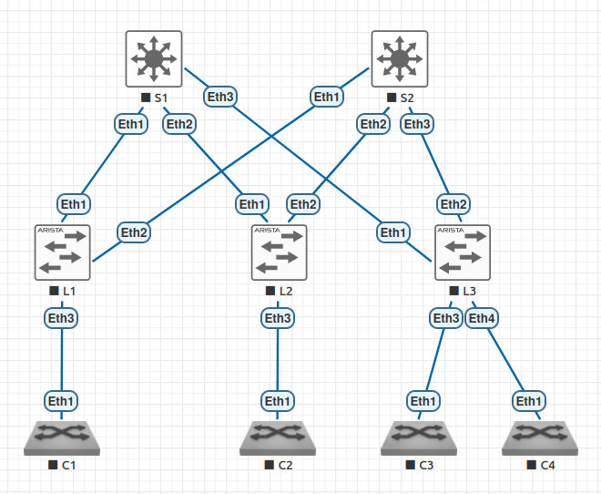
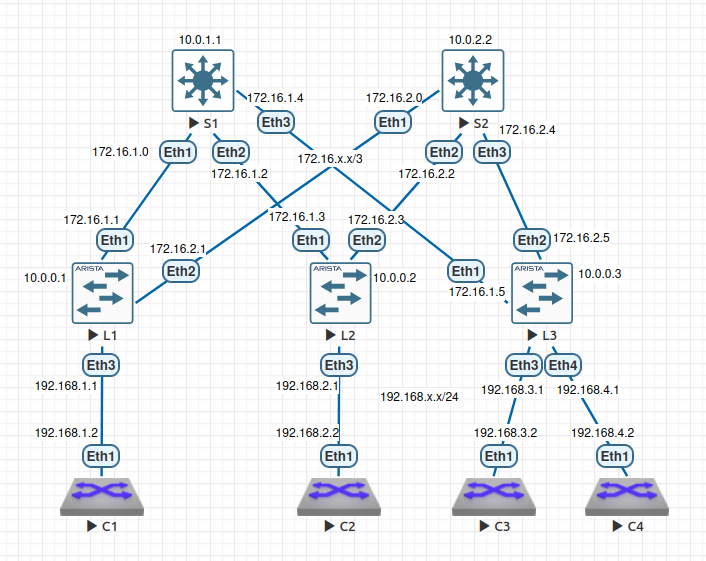

# Домашнее задание №1 «Проектирование адресного пространства»

## Цели

* [Часть 1. Сборка топологии.](#часть-1-сборка-топологии)
* [Часть 2. Распределение адресного пространства.](#часть-2-распределение-адресного-пространства)
* [Часть 3. Настройка оборудования.](#часть-3-настройка-оборудования)

## Общие сведения/сценарий

В данной работе необходимо собрать топологию согласно образцу, распределить адресное
пространство для underlay сети, выполнить настройку оборудования.

Образец топологии:


## Часть 1. Сборка топологии

Для выполнения работы был настроен стенд в среде EVE-NG 6.2.0-4 CE. Для узлов
использовались образы коммутаторов Arista (vEOS-lab-4.35.1F).

Развёртываемая топология представляет собой сеть Клоза из двух спайнов и трёх лифов.
Создадим необходимое количество узлов и соединим их между собой согласно образцу.



## Часть 2. Распределение адресного пространства

Для каждого узла выделим IP адрес под underlay лупбэк:

| Имя узла | IP-адрес |
|----------|----------|
| Spine1   | 10.0.1.1 |
| Spine2   | 10.0.2.2 |
| Leaf1    | 10.0.0.1 |
| Leaf2    | 10.0.0.2 |
| Leaf3    | 10.0.0.3 |

Линкам между узлами выдадим адреса из диапазона 172.16.x.y, point-to-point сабсети
с маской /31, где x - номер спайна.

| Имя узла | IP-адрес   | Сосед  |
|----------|------------|--------|
| Spine1   | 172.16.1.0 | Leaf1  |
| Spine1   | 172.16.1.2 | Leaf2  |
| Spine1   | 172.16.1.4 | Leaf3  |
| Spine2   | 172.16.2.0 | Leaf1  |
| Spine2   | 172.16.2.2 | Leaf2  |
| Spine2   | 172.16.2.4 | Leaf3  |
| Leaf1    | 172.16.1.1 | Spine1 |
| Leaf1    | 172.16.2.1 | Spine2 |
| Leaf2    | 172.16.1.3 | Spine1 |
| Leaf2    | 172.16.2.3 | Spine2 |
| Leaf3    | 172.16.1.5 | Spine1 |
| Leaf3    | 172.16.2.5 | Spine2 |

Под клиентские адреса выделим сети 192.168.x.y/24, где x - номер клиента.

| Имя узла | IP-адрес    | Сосед   |
|----------|-------------|---------|
| Client1  | 192.168.1.2 | Leaf1   |
| Client2  | 192.168.2.2 | Leaf2   |
| Client3  | 192.168.3.2 | Leaf3   |
| Client4  | 192.168.4.2 | Leaf3   |
| Leaf1    | 192.168.1.1 | Client1 |
| Leaf2    | 192.168.2.1 | Client2 |
| Leaf3    | 192.168.3.1 | Client3 |
| Leaf3    | 192.168.4.1 | Client4 |

В реальном ЦОДе такое расточительство адресов неоправданно, но в учебных целях допустимо.

Топология с IP-адресами:



## Часть 3. Настройка оборудования

Для каждого коммутатора зададим имя узла, создадим лупбэк и включим IP маршрутизацию.
На используемых интерфейсах настроим:

* l3 режим;
* IPv4 адрес.

Пример команд для узла **S1** (спайн):

```text
localhost>enable
localhost#conf t
localhost(config)#hostname S1
S1(config)#ip routing
S1(config)#int Lo0
S1(config-if-Lo0)#ip address 10.0.1.1/32
S1(config-if-Lo0)#int Eth1
S1(config-if-Et1)#no switchport
S1(config-if-Et1)#ip address 172.16.1.0/31
S1(config-if-Et1)#int Eth2
S1(config-if-Et2)#no switchport
S1(config-if-Et2)#ip address 172.16.1.2/31
S1(config-if-Et2)#int Eth3
S1(config-if-Et3)#no switchport
S1(config-if-Et3)#ip address 172.16.1.4/31
S1(config-if-Et3)#end
S1#wr
Copy completed successfully.
S1#
```

Аналогично настроим и остальные узлы (согласно таблицам IP-адресации).

Проверим пинг с первого спайна на первый лиф:

```text
S1#ping 172.16.1.1
PING 172.16.1.1 (172.16.1.1) 72(100) bytes of data.
80 bytes from 172.16.1.1: icmp_seq=1 ttl=64 time=6.03 ms
80 bytes from 172.16.1.1: icmp_seq=2 ttl=64 time=1.30 ms
80 bytes from 172.16.1.1: icmp_seq=3 ttl=64 time=0.974 ms
80 bytes from 172.16.1.1: icmp_seq=4 ttl=64 time=1.01 ms
80 bytes from 172.16.1.1: icmp_seq=5 ttl=64 time=1.04 ms

--- 172.16.1.1 ping statistics ---
5 packets transmitted, 5 received, 0% packet loss, time 24ms
rtt min/avg/max/mdev = 0.974/2.068/6.025/1.981 ms, ipg/ewma 5.986/3.973 ms
S1#
```

Пинг с первого клиента на первый лиф:

```text
C1#ping 192.168.1.1
PING 192.168.1.1 (192.168.1.1) 72(100) bytes of data.
80 bytes from 192.168.1.1: icmp_seq=1 ttl=64 time=3.59 ms
80 bytes from 192.168.1.1: icmp_seq=2 ttl=64 time=1.57 ms
80 bytes from 192.168.1.1: icmp_seq=3 ttl=64 time=1.34 ms
80 bytes from 192.168.1.1: icmp_seq=4 ttl=64 time=1.34 ms
80 bytes from 192.168.1.1: icmp_seq=5 ttl=64 time=1.25 ms

--- 192.168.1.1 ping statistics ---
5 packets transmitted, 5 received, 0% packet loss, time 16ms
rtt min/avg/max/mdev = 1.245/1.815/3.587/0.892 ms, ipg/ewma 4.012/2.664 ms
C1#
```

## Файлы настроек

Файлы настроек устройств (конфиги) экспортированы в каталог [configs](./configs/).

Готовая лабораторная (экспорт из EVE-NG) - [03_ip_plan.zip](./03_ip_plan.zip).
