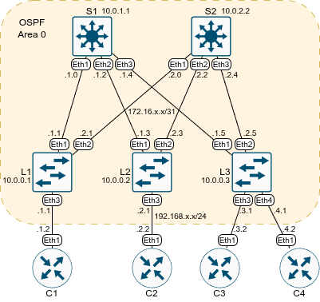

# Домашнее задание №2 «Underlay. OSPF»

## Цель

Настроить OSPF для Underlay сети для IP связности между
всеми сетевыми устройствами.

## Топология

Топология лабораторного стенда собрана в среде EVE-NG.



## Настройка OSPF

Все узлы нашей сети будут находиться в одной OSPF зоне - бекбоне.

На каждом узле необходимо:

* включить OSPF процесс;
* назначить router-id;
* включить пассивные интерфейсы по умолчанию;
* явно определить активные интерфейсы;
* настроить таймеры (уменьшить);
* включить редистрибьюцию лупбэков (и других подключённых сетей);
* явно добавить все необходимые интерфейсы в ospf;
* включить режим "точка-точка" на линках между спайнами и лифами.

Пример команд для первого спайна:

```text
enable
conf t
router ospf 1
  router-id 10.0.1.1
  passive-interface default
  no passive-interface Eth 1-3
  redistribute connected
int Eth 1-3
  ip ospf area 0
  ip ospf hello-interval 1
  ip ospf dead-interval 4
  ip ospf network point-to-point
  end
wr
```

Выведем информацию о соседях на Лифе1:

```text
L1#sh ip ospf neighbor 
Neighbor ID     Instance VRF      Pri State                  Dead Time   Address         Interface
10.0.2.2        1        default  0   FULL                   00:00:02    172.16.2.0      Ethernet2
10.0.1.1        1        default  0   FULL                   00:00:02    172.16.1.0      Ethernet1
L1#
```

Список маршрутов (без заголовка-легенды):

```text
L1#show ip route

VRF: default
Gateway of last resort is not set

 C        10.0.0.1/32
           directly connected, Loopback0
 O E2     10.0.0.2/32 [110/1]
           via 172.16.1.0, Ethernet1
           via 172.16.2.0, Ethernet2
 O E2     10.0.0.3/32 [110/1]
           via 172.16.1.0, Ethernet1
           via 172.16.2.0, Ethernet2
 O E2     10.0.1.1/32 [110/1]
           via 172.16.1.0, Ethernet1
 O E2     10.0.2.2/32 [110/1]
           via 172.16.2.0, Ethernet2
 C        172.16.1.0/31
           directly connected, Ethernet1
 O        172.16.1.2/31 [110/20]
           via 172.16.1.0, Ethernet1
 O        172.16.1.4/31 [110/20]
           via 172.16.1.0, Ethernet1
 C        172.16.2.0/31
           directly connected, Ethernet2
 O        172.16.2.2/31 [110/20]
           via 172.16.2.0, Ethernet2
 O        172.16.2.4/31 [110/20]
           via 172.16.2.0, Ethernet2
 C        192.168.1.0/24
           directly connected, Ethernet3
 O E2     192.168.2.0/24 [110/1]
           via 172.16.1.0, Ethernet1
           via 172.16.2.0, Ethernet2
 O E2     192.168.3.0/24 [110/1]
           via 172.16.1.0, Ethernet1
           via 172.16.2.0, Ethernet2
 O E2     192.168.4.0/24 [110/1]
           via 172.16.1.0, Ethernet1
           via 172.16.2.0, Ethernet2

L1#
```

Лупбэки пингуются:

```text
L1#ping 10.0.0.3 repeat 1
PING 10.0.0.3 (10.0.0.3) 72(100) bytes of data.
80 bytes from 10.0.0.3: icmp_seq=1 ttl=63 time=3.27 ms

--- 10.0.0.3 ping statistics ---
1 packets transmitted, 1 received, 0% packet loss, time 0ms
rtt min/avg/max/mdev = 3.271/3.271/3.271/0.000 ms
L1#
```

На клиентских устройствах зададим статический маршрут по умолчанию в сторону
соответствующего лифа:

```text
ip route 0.0.0.0 0.0.0.0 192.168.1.1
```

Теперь пинги ходят и между клиентами:

```text
C1#ping 192.168.4.2 repeat 1
PING 192.168.4.2 (192.168.4.2) 72(100) bytes of data.
80 bytes from 192.168.4.2: icmp_seq=1 ttl=61 time=5.65 ms

--- 192.168.4.2 ping statistics ---
1 packets transmitted, 1 received, 0% packet loss, time 0ms
rtt min/avg/max/mdev = 5.646/5.646/5.646/0.000 ms
C1#
```

## Файлы настроек

Файлы настроек устройств (конфиги) экспортированы в каталог [configs](./configs/).

Готовая лабораторная (экспорт из EVE-NG) - [05_ospf.zip](./05_ospf.zip).
