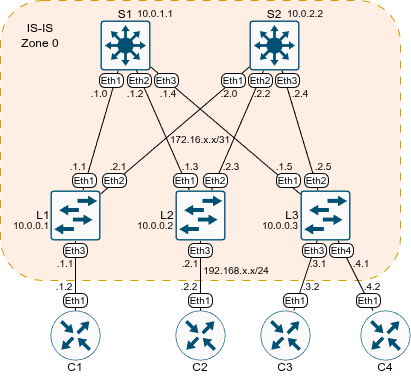

# Домашнее задание №3 «Underlay. IS-IS»

## Цель

Настроить IS-IS для Underlay сети для IP связности между
всеми сетевыми устройствами.

## Топология

Топология лабораторного стенда собрана в среде EVE-NG.



## Настройка IS-IS

Все узлы нашей сети будут находиться в одной IS-IS зоне, тип соседства - L1.

На каждом узле необходимо:

* включить IS-IS процесс;
* назначить идентификатор сети;
* задать режим L1;
* включить редистрибьюцию лупбэков (и других подключённых сетей);
* активировать адресное семейство IPv4 unicast;
* включить IS-IS на интерфейсах в сторону лифов и спайнов;
* включить режим "точка-точка" на линках между спайнами и лифами.

Пример команд для первого спайна:

```text
enable
conf t
router isis UNDERLAY
  net 49.0000.0100.0000.1001.00
  is-type level-1
  redistribute connected
  address-family ipv4 unicast
int Eth 1-3
  isis enable UNDERLAY
  isis network point-to-point 
end
wr
```

Аналогичные команды выполним и на других спайнах и лифах, корректируя, где необходимо,
идентификаторы IS-IS и интерфейсы.

Выведем информацию о соседях на Лифе1:

```text
1#show isis neighbors 
 
Instance  VRF      System Id        Type Interface          SNPA              State Hold time   Circuit Id          
UNDERLAY  default  S1               L1   Ethernet1          P2P               UP    23          0D                  
UNDERLAY  default  S2               L1   Ethernet2          P2P               UP    28          11                  
L1#
```

База данных IS-IS:

```text
L1#show isis database 
Legend:
H - hostname conflict
U - node unreachable

IS-IS Instance: UNDERLAY VRF: default
  IS-IS Level 1 Link State Database
    LSPID                   Seq Num  Cksum  Life Length IS  Received LSPID        Flags
    L1.00-00                      9   1271  1158    124 L1  0100.0000.0001.00-00  <>
    L2.00-00                      9  22168  1171    124 L1  0100.0000.0002.00-00  <>
    L3.00-00                      9  17934  1180    132 L1  0100.0000.0003.00-00  <>
    S1.00-00                     13  60123  1180    140 L1  0100.0000.1001.00-00  <>
    S2.00-00                     13  41225  1177    140 L1  0100.0000.2002.00-00  <>

L1#
```

Список маршрутов (без заголовка-легенды):

```text
L1#show ip route

VRF: default

Gateway of last resort is not set

 C        10.0.0.1/32
           directly connected, Loopback0
 I L1     10.0.0.2/32 [115/20]
           via 172.16.1.0, Ethernet1
           via 172.16.2.0, Ethernet2
 I L1     10.0.0.3/32 [115/20]
           via 172.16.1.0, Ethernet1
           via 172.16.2.0, Ethernet2
 I L1     10.0.1.1/32 [115/10]
           via 172.16.1.0, Ethernet1
 I L1     10.0.2.2/32 [115/10]
           via 172.16.2.0, Ethernet2
 C        172.16.1.0/31
           directly connected, Ethernet1
 I L1     172.16.1.2/31 [115/20]
           via 172.16.1.0, Ethernet1
 I L1     172.16.1.4/31 [115/20]
           via 172.16.1.0, Ethernet1
 C        172.16.2.0/31
           directly connected, Ethernet2
 I L1     172.16.2.2/31 [115/20]
           via 172.16.2.0, Ethernet2
 I L1     172.16.2.4/31 [115/20]
           via 172.16.2.0, Ethernet2
 C        192.168.1.0/24
           directly connected, Ethernet3
 I L1     192.168.2.0/24 [115/20]
           via 172.16.1.0, Ethernet1
           via 172.16.2.0, Ethernet2
 I L1     192.168.3.0/24 [115/20]
           via 172.16.1.0, Ethernet1
           via 172.16.2.0, Ethernet2
 I L1     192.168.4.0/24 [115/20]
           via 172.16.1.0, Ethernet1
           via 172.16.2.0, Ethernet2

L1#
```

Лупбэки пингуются:

```text
L1#ping 10.0.0.3 repeat 1
PING 10.0.0.3 (10.0.0.3) 72(100) bytes of data.
80 bytes from 10.0.0.3: icmp_seq=1 ttl=63 time=4.62 ms

--- 10.0.0.3 ping statistics ---
1 packets transmitted, 1 received, 0% packet loss, time 0ms
rtt min/avg/max/mdev = 4.624/4.624/4.624/0.000 ms
L1#
```

На клиентских устройствах зададим статический маршрут по умолчанию в сторону
соответствующего лифа:

```text
ip route 0.0.0.0 0.0.0.0 192.168.1.1
```

Теперь пинги ходят и между клиентами:

```text
C1#ping 192.168.4.2 repeat 1
PING 192.168.4.2 (192.168.4.2) 72(100) bytes of data.
80 bytes from 192.168.4.2: icmp_seq=1 ttl=61 time=11.0 ms

--- 192.168.4.2 ping statistics ---
1 packets transmitted, 1 received, 0% packet loss, time 0ms
rtt min/avg/max/mdev = 10.984/10.984/10.984/0.000 ms
C1#
```

## Файлы настроек

Файлы настроек устройств (конфиги) экспортированы в каталог [configs](./configs/).

Готовая лабораторная (экспорт из EVE-NG) - [06_isis.zip](./06_isis.zip).
