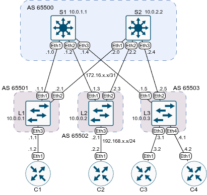

# Домашнее задание №4 «Underlay. eBGP»

## Цель

Настроить eBGP для Underlay сети для IP связности между
всеми сетевыми устройствами.

## Топология

Топология лабораторного стенда собрана в среде EVE-NG.



## Настройка eBGP

Все спайны будут находиться в одной автономной системе, каждый лиф - в отдельной.
Для автоматического добавления лифов на спайны будем использовать peer-filter и
listen-range. BGP таймеры уменьшены до 10/30. При более агрессивных сессия периодически
флапала из-за недостатка ресурсов на виртуализацию.

### Конфигурация спайнов

На каждом узле необходимо:

* включить BGP процесс;
* назначить идентификатор маршрутизатора;
* создать пир группу;
* отключить активацию BGP в IPv4 unicast по умолчанию;
* уменьшить таймеры;
* указать диапазон прослушивания для добавления лифов в пир-группу;
* в адресном семейство IPv4 unicast активировать пир группу и добавить
  лупбэк;
* создать пир-фильтр для добавления лифов в пир-группу.

Пример команд для первого спайна:

```text
enable
conf t
router bgp 65500
router-id 10.0.1.1
neighbor UNDERLAY peer group
no bgp default ipv4-unicast
timers bgp 10 30
bgp listen range 172.16.0.0/16 peer-group UNDERLAY peer-filter LEAVES_ASN
address-family ipv4
  network 10.0.1.1/32
  neighbor UNDERLAY activate
exit

peer-filter LEAVES_ASN
  10 match as-range 65501 - 65700 result accept
end
wr
```

Аналогичные команды выполним и на втором спайне.

### Конфигурация лифов

На каждом узле необходимо:

* включить BGP процесс;
* назначить идентификатор маршрутизатора;
* создать пир группу;
* указать номер удалённой автономной системы для пир группы;
* добавить пиры (спайны) в пир группу;
* уменьшить таймеры;
* отключить активацию BGP в IPv4 unicast по умолчанию;
* в адресном семейство IPv4 unicast активировать пир группу, добавить
  лупбэк и клиентские сети.

Пример команд для первого лифа:

```text
enable
conf t
router bgp 65501
router-id 10.0.0.1
neighbor UNDERLAY peer group
neighbor UNDERLAY remote-as 65500
neighbor 172.16.1.0 peer group UNDERLAY
neighbor 172.16.2.0 peer group UNDERLAY
timers bgp 10 30
no bgp default ipv4-unicast
address-family ipv4
  neighbor UNDERLAY activate
  network 10.0.0.1/32
  network 192.168.1.0/24
end
wr
```

Аналогичные команды выполним и на других спайнах и лифах, корректируя, где необходимо,
номера автономных систем, router-id и адреса сетей.

### Проверка работы

Выведем информацию о соседях на Лифе1:

```text
L1#show bgp summary 
BGP summary information for VRF default
Router identifier 10.0.0.1, local AS number 65501
Neighbor            AS Session State AFI/SAFI                AFI/SAFI State   NLRI Rcd   NLRI Acc   NLRI Adv
---------- ----------- ------------- ----------------------- -------------- ---------- ---------- ----------
172.16.1.0       65500 Established   IPv4 Unicast            Negotiated              6          6          3
172.16.2.0       65500 Established   IPv4 Unicast            Negotiated              6          6          8
L1#
```

Таблица маршрутизации BGP:

```text
L1#show ip bgp
BGP routing table information for VRF default
Router identifier 10.0.0.1, local AS number 65501
Route status codes: s - suppressed contributor, * - valid, > - active, E - ECMP head, e - ECMP
                    S - Stale, c - Contributing to ECMP, b - backup, L - labeled-unicast, q - Pending FIB install
                    % - Pending best path selection
Origin codes: i - IGP, e - EGP, ? - incomplete
RPKI Origin Validation codes: V - valid, I - invalid, U - unknown
AS Path Attributes: Or-ID - Originator ID, C-LST - Cluster List, LL Nexthop - Link Local Nexthop

          Network                Next Hop              Metric  AIGP       LocPref Weight  Path
 * >      10.0.0.1/32            -                     -       -          -       0       i
 * >      10.0.0.2/32            172.16.1.0            0       -          100     0       65500 65502 i
 *        10.0.0.2/32            172.16.2.0            0       -          100     0       65500 65502 i
 * >      10.0.0.3/32            172.16.1.0            0       -          100     0       65500 65503 i
 *        10.0.0.3/32            172.16.2.0            0       -          100     0       65500 65503 i
 * >      10.0.1.1/32            172.16.1.0            0       -          100     0       65500 i
 * >      10.0.2.2/32            172.16.2.0            0       -          100     0       65500 i
 * >      192.168.1.0/24         -                     -       -          -       0       i
 * >      192.168.2.0/24         172.16.1.0            0       -          100     0       65500 65502 i
 *        192.168.2.0/24         172.16.2.0            0       -          100     0       65500 65502 i
 * >      192.168.3.0/24         172.16.1.0            0       -          100     0       65500 65503 i
 *        192.168.3.0/24         172.16.2.0            0       -          100     0       65500 65503 i
 * >      192.168.4.0/24         172.16.1.0            0       -          100     0       65500 65503 i
 *        192.168.4.0/24         172.16.2.0            0       -          100     0       65500 65503 i
L1#
```

Список маршрутов (без заголовка-легенды):

```text
L1#show ip route

VRF: default

Gateway of last resort is not set

 C        10.0.0.1/32
           directly connected, Loopback0
 B E      10.0.0.2/32 [200/0]
           via 172.16.1.0, Ethernet1
 B E      10.0.0.3/32 [200/0]
           via 172.16.1.0, Ethernet1
 B E      10.0.1.1/32 [200/0]
           via 172.16.1.0, Ethernet1
 B E      10.0.2.2/32 [200/0]
           via 172.16.2.0, Ethernet2
 C        172.16.1.0/31
           directly connected, Ethernet1
 C        172.16.2.0/31
           directly connected, Ethernet2
 C        192.168.1.0/24
           directly connected, Ethernet3
 B E      192.168.2.0/24 [200/0]
           via 172.16.1.0, Ethernet1
 B E      192.168.3.0/24 [200/0]
           via 172.16.1.0, Ethernet1
 B E      192.168.4.0/24 [200/0]
           via 172.16.1.0, Ethernet1

L1#
```

Лупбэки пингуются:

```text
L1#ping 10.0.0.3 repeat 1 source 10.0.0.1
PING 10.0.0.3 (10.0.0.3) from 10.0.0.1 : 72(100) bytes of data.
80 bytes from 10.0.0.3: icmp_seq=1 ttl=63 time=3.31 ms

--- 10.0.0.3 ping statistics ---
1 packets transmitted, 1 received, 0% packet loss, time 0ms
rtt min/avg/max/mdev = 3.313/3.313/3.313/0.000 ms
L1#
```

### Настройка клиентов

На клиентских устройствах зададим статический маршрут по умолчанию в сторону
соответствующего лифа:

```text
ip route 0.0.0.0 0.0.0.0 192.168.1.1
```

Теперь пинги ходят и между клиентами:

```text
C1#ping 192.168.4.2 repeat 1
PING 192.168.4.2 (192.168.4.2) 72(100) bytes of data.
80 bytes from 192.168.4.2: icmp_seq=1 ttl=61 time=6.33 ms

--- 192.168.4.2 ping statistics ---
1 packets transmitted, 1 received, 0% packet loss, time 0ms
rtt min/avg/max/mdev = 6.326/6.326/6.326/0.000 ms
C1#
```

## Файлы настроек

Файлы настроек устройств (конфиги) экспортированы в каталог [configs](./configs/).

Готовая лабораторная (экспорт из EVE-NG) - [08_ebgp.zip](./08_ebgp.zip).
