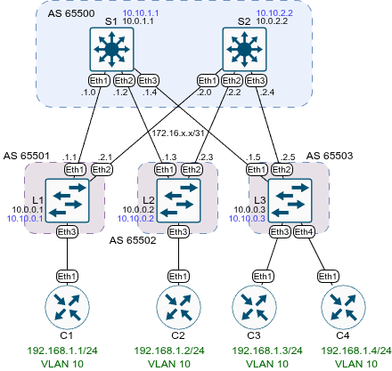

# Домашнее задание №5 «VxLAN. EVPN L2»

## Цель

Настроить Overlay на основе VxLAN EVPN для L2 связанности между клиентами.

* [Часть 1. Настройка BGP peering.](#1-настройка-bgp-peering)
* [Часть 2. Настройка и проверка L2 связанности.](#2-настройка-и-проверка-l2-связанности)

## Топология

Топология лабораторного стенда собрана в среде EVE-NG.



## 1. Настройка BGP peering

Настроим BGP peering между Leaf и Spine в AF l2vpn EVPN. В качестве основы возьмём
предыдущую лабораторную работу, в которой в качестве Underlay был настроен eBGP.
Для Overlay будем также использовать eBGP. Для Overlay создадим новые лупбэки.

### Конфигурация спайнов

На каждом узле необходимо:

* включить MP BGP;
* создать лупбэк для оверлея;
* разрешить несколько маршрутов (maximum-paths);
* создать пир группу для EVPN;
* отменить замену некстхопа;
* использовать для EVPN лупбэк оверлея;
* включить ebgp-multihop;
* включить отправку расширенного сообщества;
* указать диапазон прослушивания для добавления лифов в пир-группу;
* в адресном семейство evpn активировать пир группу и добавить
  лупбэк.

Пример команд для первого спайна:

```text
enable
conf t
service routing protocols model multi-agent
int lo1
ip address 10.10.1.1/32
router bgp 65500
maximum-paths 10
neighbor EVPN peer group
neighbor EVPN next-hop-unchanged
neighbor EVPN update-source lo1
neighbor EVPN ebgp-multihop 3
neighbor EVPN send-community extended
bgp listen range 10.10.0.0/16 peer-group EVPN peer-filter LEAVES_ASN
address-family evpn
neighbor EVPN activate
network 10.10.1.1/32
end
wr
```

Аналогичные команды выполним и на втором спайне.

### Конфигурация лифов

На каждом узле необходимо:

* включить MP BGP;
* создать лупбэк для оверлея;
* разрешить несколько маршрутов (maximum-paths);
* создать пир группу для EVPN;
* отменить замену некстхопа;
* использовать для EVPN лупбэк оверлея;
* включить ebgp-multihop;
* включить отправку расширенного сообщества;
* добавить пиры (спайны);
* в адресном семейство evpn активировать пир группу и добавить
  лупбэк.

Пример команд для первого лифа:

```text
enable
conf t
service routing protocols model multi-agent
int lo1
ip address 10.10.0.1/32
router bgp 65501
maximum-paths 2
neighbor EVPN peer group
neighbor EVPN remote-as 65500
neighbor EVPN next-hop-unchanged
neighbor EVPN update-source lo1
neighbor EVPN ebgp-multihop 3
neighbor EVPN send-community extended
neighbor 10.10.1.1 peer group EVPN
neighbor 10.10.2.2 peer group EVPN
address-family evpn
neighbor EVPN activate
network 10.10.0.1/32
no network 192.168.1.0/24
end
wr
```

Аналогичные команды выполним и на других лифах, корректируя, где необходимо,
номера автономных систем и адреса.

## 2. Настройка и проверка L2 связанности

Клиенты будут связаны между собой через VXLAN. На лифах создадим VLAN и VXLAN
интерфейс, сопоставим VLAN и VNI, настроим генерацию RD и RT в overlay eBGP.
Интерфейсы в сторону клиентов переведём в access (можно и в trunk, если требуется
прокинуть несколько VLAN).

### Настройка лифов

Пример команд для лифа1:

```text
enable
conf t
vlan 10
  name VLAN10
int Eth3
  switchport
  no ip address 192.168.1.1/24
  switchport access vlan 10
interface Vxlan 1
  vxlan source-interface Loopback1
  vxlan vlan 10 vni 100010
router bgp 65501
  vlan 10
    rd auto
    route-target both 10:100010
    redistribute learned
end
wr
```

### Настройка клиентов

На клиентах удалим настройки L3, поменяем адреса.

```text
enable
conf t
no ip routing
no ip route 0.0.0.0/0 192.168.1.1
interface Ethernet1
  no ip address 192.168.1.2/24
  ip address 192.168.1.1/24
end
wr
```

### Проверка работы

Выведем информацию о BGP:

```text
L1#sh bgp summary
BGP summary information for VRF default
Router identifier 10.0.0.1, local AS number 65501
Neighbor            AS Session State AFI/SAFI                AFI/SAFI State   NLRI Rcd   NLRI Acc   NLRI Adv
---------- ----------- ------------- ----------------------- -------------- ---------- ---------- ----------
10.10.1.1        65500 Established   L2VPN EVPN              Negotiated              2          2          1
10.10.2.2        65500 Established   L2VPN EVPN              Negotiated              2          2          3
172.16.1.0       65500 Established   IPv4 Unicast            Negotiated              6          6          5
172.16.2.0       65500 Established   IPv4 Unicast            Negotiated              6          6          7
```

Информация о BGP EVPN:

```text
L1#sh bgp evpn summary 
BGP summary information for VRF default
Router identifier 10.0.0.1, local AS number 65501
Neighbor Status Codes: m - Under maintenance
  Neighbor  V AS           MsgRcvd   MsgSent  InQ OutQ  Up/Down State   PfxRcd PfxAcc PfxAdv
  10.10.1.1 4 65500            934       935    0    0 00:29:00 Estab   2      2      1
  10.10.2.2 4 65500            926       927    0    0 00:29:00 Estab   2      2      3
```

Известные RD:

```text
L1#sh bgp evpn 
BGP routing table information for VRF default
Router identifier 10.0.0.1, local AS number 65501
Route status codes: * - valid, > - active, S - Stale, E - ECMP head, e - ECMP
                    c - Contributing to ECMP, % - Pending best path selection
Origin codes: i - IGP, e - EGP, ? - incomplete
AS Path Attributes: Or-ID - Originator ID, C-LST - Cluster List, LL Nexthop - Link Local Nexthop

          Network                Next Hop              Metric  LocPref Weight  Path
 * >      RD: 10.0.0.1:10 imet 10.10.0.1
                                 -                     -       -       0       i
 * >Ec    RD: 10.0.0.2:10 imet 10.10.0.2
                                 10.10.0.2             -       100     0       65500 65502 i
 *  ec    RD: 10.0.0.2:10 imet 10.10.0.2
                                 10.10.0.2             -       100     0       65500 65502 i
 * >Ec    RD: 10.0.0.3:10 imet 10.10.0.3
                                 10.10.0.3             -       100     0       65500 65503 i
 *  ec    RD: 10.0.0.3:10 imet 10.10.0.3
                                 10.10.0.3             -       100     0       65500 65503 i
```

Список доступных VTEP:

```text
L1#sh vxlan vtep
Remote VTEPS for Vxlan1:

VTEP            Tunnel Type(s)
--------------- --------------
10.10.0.2       flood         
10.10.0.3       flood         

Total number of remote VTEPS:  2
```

Известные mac-ip (после пинга с одного из клиентов):

```text
L1#sh bgp evpn route-type mac-ip
BGP routing table information for VRF default
Router identifier 10.0.0.1, local AS number 65501
Route status codes: * - valid, > - active, S - Stale, E - ECMP head, e - ECMP
                    c - Contributing to ECMP, % - Pending best path selection
Origin codes: i - IGP, e - EGP, ? - incomplete
AS Path Attributes: Or-ID - Originator ID, C-LST - Cluster List, LL Nexthop - Link Local Nexthop

          Network                Next Hop              Metric  LocPref Weight  Path
 * >Ec    RD: 10.0.0.3:10 mac-ip 5000.006b.2e70
                                 10.10.0.3             -       100     0       65500 65503 i
 *  ec    RD: 10.0.0.3:10 mac-ip 5000.006b.2e70
                                 10.10.0.3             -       100     0       65500 65503 i
 * >      RD: 10.0.0.1:10 mac-ip 5000.0072.8b31
```

Детальная информация о MAC:

```text
L1#sh bgp evpn route-type mac-ip 5000.006b.2e70 detail 
BGP routing table information for VRF default
Router identifier 10.0.0.1, local AS number 65501
BGP routing table entry for mac-ip 5000.006b.2e70, Route Distinguisher: 10.0.0.3:10
 Paths: 2 available
  65500 65503
    10.10.0.3 from 10.10.1.1 (10.0.1.1)
      Origin IGP, metric -, localpref 100, weight 0, tag 0, valid, external, ECMP head, ECMP, best, ECMP contributor
      Extended Community: Route-Target-AS:10:100010 TunnelEncap:tunnelTypeVxlan
      VNI: 100010 ESI: 0000:0000:0000:0000:0000
  65500 65503
    10.10.0.3 from 10.10.2.2 (10.0.2.2)
      Origin IGP, metric -, localpref 100, weight 0, tag 0, valid, external, ECMP, ECMP contributor
      Extended Community: Route-Target-AS:10:100010 TunnelEncap:tunnelTypeVxlan
      VNI: 100010 ESI: 0000:0000:0000:0000:0000
```

Пинг с клиента:

```text
C1#ping 192.168.1.4 repeat 1
PING 192.168.1.4 (192.168.1.4) 72(100) bytes of data.
80 bytes from 192.168.1.4: icmp_seq=1 ttl=64 time=8.78 ms

--- 192.168.1.4 ping statistics ---
1 packets transmitted, 1 received, 0% packet loss, time 0ms
rtt min/avg/max/mdev = 8.780/8.780/8.780/0.000 ms
```

## Файлы настроек

Файлы настроек устройств (конфиги) экспортированы в каталог [configs](./configs/).

Готовая лабораторная (экспорт из EVE-NG) - [11_evpn_l2.zip](./11_evpn_l2.zip).
