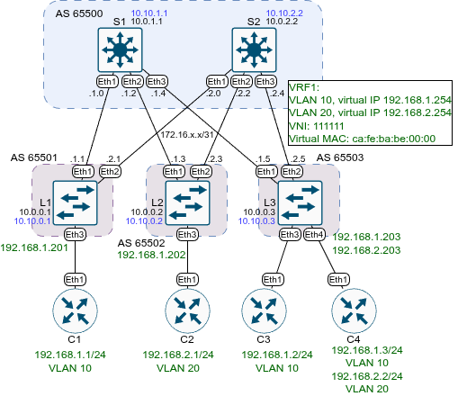

# Домашнее задание №6 «VxLAN. EVPN L3»

## Цель

Настроить маршрутизацию в рамках Overlay между клиентами.

* [Часть 1. Настройка VNI.](#1-настройка-vni)
* [Часть 2. Настройка маршрутизации.](#2-настройка-маршрутизации)

## Топология

Топология лабораторного стенда собрана в среде EVE-NG.



## 1. Настройка VNI

Настроим VNI для каждого клиента и VLAN. В качестве основы возьмём
предыдущую лабораторную работу по L2 EVPN (eBGP over eBGP), таким образом часть настроек уже
выполнена и останется лишь внести изменения.

На спайнах ничего настраивать не надо.

На каждом лифе необходимо выполнить:

* создать vrf;
* включить ipv4 маршрутизацию для vrf;
* добавить виртуальный MAC-адрес;
* для каждого клиентского vlan входящего в vrf создать SVI, присвоить ему
* виртуальный IP адрес и обычный (для диагностики), привязать к vrf.

Пример команд для первого лифа:

```text
enable
conf t
vrf instance VRF1
ip routing vrf VRF1
ip virtual-router mac-address ca:fe:ba:be:00:00
interface Vlan10
  vrf VRF1
  ip address 192.168.1.201/24
  ip virtual-router address 192.168.1.254
interface Vxlan 1
  vxlan vlan 10 vni 100010
  vxlan vlan 20 vni 100020
  vxlan vrf VRF1 vni 111111
  vxlan learn-restrict any
end
wr
```

Аналогичные команды выполним и на других лифах, корректируя, где необходимо,
номера вланов, автономных систем и адреса.

## 2. Настройка маршрутизации

### Настройка лифов

На каждом лифе добавим в настройки BGP вланы (MAC VRF), зададим для них RD и RT,
настроим vrf, а также RD и RT для vrf.

```text
enable
conf t
router bgp 65001
  vlan 10
    rd auto
    route-target both 10:100010
    redistribute learned
  vlan 20
    rd auto
    route-target both 20:100020
     redistribute learned
  vrf VRF1
    rd 65501:1
    route-target import evpn 1:111111
    route-target export evpn 1:111111
    redistribute connected
end
wr
```

Также на лифах настроим интерфейсы в сторону клиентов (от предыдущей лабы остались
access порты, переведём их в транк):

```text
enable
conf t
int Eth3
  no switchport access vlan 10
  switchport mode trunk
end
wr
```

### Настройка клиентов

На клиентах настроим L3 маршрутизацию, создадим VLAN`ы. На C1 и C3 будет VLAN10,
на C2 VLAN20, на С4 оба влана.

```text
enable
conf t
ip routing
ip route 0.0.0.0/0 192.168.1.254
vlan 10
interface Ethernet1
  no ip address 192.168.1.1/24
  switchport
  switchport mode trunk
interface vlan10
  ip address 192.168.1.1/24
end
wr
```

### Проверка работы

Выведем информацию о BGP:

```text
L1#sh bgp summary 
BGP summary information for VRF default
Router identifier 10.0.0.1, local AS number 65501
Neighbor            AS Session State AFI/SAFI                AFI/SAFI State   NLRI Rcd   NLRI Acc   NLRI Adv
---------- ----------- ------------- ----------------------- -------------- ---------- ---------- ----------
10.10.1.1        65500 Established   L2VPN EVPN              Negotiated             11         11         11
10.10.2.2        65500 Established   L2VPN EVPN              Negotiated             11         11          8
172.16.1.0       65500 Established   IPv4 Unicast            Negotiated              6          6          6
172.16.2.0       65500 Established   IPv4 Unicast            Negotiated              6          6          6
```

Информация о BGP EVPN:

```text
L1#sh bgp evpn summary 
BGP summary information for VRF default
Router identifier 10.0.0.1, local AS number 65501
Neighbor Status Codes: m - Under maintenance
  Neighbor  V AS           MsgRcvd   MsgSent  InQ OutQ  Up/Down State   PfxRcd PfxAcc PfxAdv
  10.10.1.1 4 65500           8009      7989    0    0 18:49:18 Estab   11     11     11
  10.10.2.2 4 65500           7988      7982    0    0 18:49:18 Estab   11     11     8
```

Известные mac-ip (после пинга с одного из клиентов):

```text
L1#sh bgp evpn route-type mac-ip 
BGP routing table information for VRF default
Router identifier 10.0.0.1, local AS number 65501
Route status codes: * - valid, > - active, S - Stale, E - ECMP head, e - ECMP
                    c - Contributing to ECMP, % - Pending best path selection
Origin codes: i - IGP, e - EGP, ? - incomplete
AS Path Attributes: Or-ID - Originator ID, C-LST - Cluster List, LL Nexthop - Link Local Nexthop

          Network                Next Hop              Metric  LocPref Weight  Path
 * >Ec    RD: 10.0.0.3:10 mac-ip 5000.006b.2e70
                                 10.10.0.3             -       100     0       65500 65503 i
 *  ec    RD: 10.0.0.3:10 mac-ip 5000.006b.2e70
                                 10.10.0.3             -       100     0       65500 65503 i
 * >Ec    RD: 10.0.0.3:10 mac-ip 5000.006b.2e70 192.168.1.3
                                 10.10.0.3             -       100     0       65500 65503 i
 *  ec    RD: 10.0.0.3:10 mac-ip 5000.006b.2e70 192.168.1.3
                                 10.10.0.3             -       100     0       65500 65503 i
 * >      RD: 10.0.0.1:10 mac-ip 5000.0072.8b31
                                 -                     -       -       0       i
 * >      RD: 10.0.0.1:10 mac-ip 5000.0072.8b31 192.168.1.1
                                 -                     -       -       0   
```

Детальная информация о MAC:

```text
L1#sh bgp evpn route-type mac-ip 5000.006b.2e70 detail
BGP routing table information for VRF default
Router identifier 10.0.0.1, local AS number 65501
BGP routing table entry for mac-ip 5000.006b.2e70, Route Distinguisher: 10.0.0.3:10
 Paths: 2 available
  65500 65503
    10.10.0.3 from 10.10.1.1 (10.0.1.1)
      Origin IGP, metric -, localpref 100, weight 0, tag 0, valid, external, ECMP head, ECMP, best, ECMP contributor
      Extended Community: Route-Target-AS:10:100010 TunnelEncap:tunnelTypeVxlan
      VNI: 100010 ESI: 0000:0000:0000:0000:0000
  65500 65503
    10.10.0.3 from 10.10.2.2 (10.0.2.2)
      Origin IGP, metric -, localpref 100, weight 0, tag 0, valid, external, ECMP, ECMP contributor
      Extended Community: Route-Target-AS:10:100010 TunnelEncap:tunnelTypeVxlan
      VNI: 100010 ESI: 0000:0000:0000:0000:0000
BGP routing table entry for mac-ip 5000.006b.2e70 192.168.1.3, Route Distinguisher: 10.0.0.3:10
 Paths: 2 available
  65500 65503
    10.10.0.3 from 10.10.1.1 (10.0.1.1)
      Origin IGP, metric -, localpref 100, weight 0, tag 0, valid, external, ECMP head, ECMP, best, ECMP contributor
      Extended Community: Route-Target-AS:1:111111 Route-Target-AS:10:100010 TunnelEncap:tunnelTypeVxlan EvpnRouterMac:50:00:00:15:f4:e8
      VNI: 100010 L3 VNI: 111111 ESI: 0000:0000:0000:0000:0000
  65500 65503
    10.10.0.3 from 10.10.2.2 (10.0.2.2)
      Origin IGP, metric -, localpref 100, weight 0, tag 0, valid, external, ECMP, ECMP contributor
      Extended Community: Route-Target-AS:1:111111 Route-Target-AS:10:100010 TunnelEncap:tunnelTypeVxlan EvpnRouterMac:50:00:00:15:f4:e8
      VNI: 100010 L3 VNI: 111111 ESI: 0000:0000:0000:0000:0000
```

Пинг с клиента:

```text
C1#ping 192.168.2.2 repeat 1
PING 192.168.2.2 (192.168.2.2) 72(100) bytes of data.
80 bytes from 192.168.2.2: icmp_seq=1 ttl=64 time=7.87 ms

--- 192.168.2.2 ping statistics ---
1 packets transmitted, 1 received, 0% packet loss, time 0ms
rtt min/avg/max/mdev = 7.869/7.869/7.869/0.000 ms
```

## Файлы настроек

Файлы настроек устройств (конфиги) экспортированы в каталог [configs](./configs/).

Готовая лабораторная (экспорт из EVE-NG) - [12_evpn_l3.zip](./12_evpn_l3.zip).
