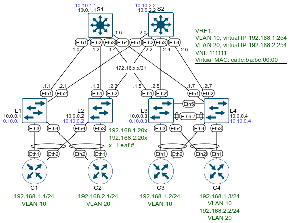

# Домашнее задание №8 «VXLAN. Routing»

## Цель

НРеализовать передачу суммарных префиксов через EVPN route-type 5.

* [1. Подключение клиентов.](#1-подключение-клиентов)
* [2. Настройка маршрутизации.](#2-настройка-маршрутизации)

## Топология

Топология лабораторного стенда собрана в среде EVE-NG.



## 1. Подключение клиентов

В качестве основы возьмём предыдущую лабораторную работу по L3 EVPN multihoming,
таким образом часть настроек уже выполнена и останется лишь внести изменения.

Переместим VLAN 20 в новый VRF. Для этого на лифах:

* создадим новый VRF;
* переместим VLAN20 в новый VRF;
* для нового VRF добавим VNI;
* добавим VRF2 в BGP.

Пример команд для первого лифа:

```text
enable
conf t
vrf instance VRF2
ip routing vrf VRF2
int vlan 20
no vrf VRF1
vrf VRF2
  ip address 192.168.2.202/24
  ip virtual-router address 192.168.2.254
int vxlan 1
  vxlan vrf VRF2 vni 222222
router bgp 65501
vrf VRF2
  rd 65501:2
  route-target import evpn 2:222222
  route-target export evpn 2:222222
  redistribute connected
end
wr
```

Для второго лифа команды те же самые, поменяется только номер
автономной системы.

Информация о VRF:

```text
L1#sh vrf
Maximum number of VRFs allowed: 1024
   VRF           Protocols       State         Interfaces        
------------- --------------- ---------------- ------------------
   VRF1          IPv4            routing       Vl10, Vl4097      
   VRF1          IPv6            no routing    Vl4097            
   VRF2          IPv4            routing       Vl20, Vl4098      
   VRF2          IPv6            no routing    Vl4098            
   default       IPv4            routing       Et1, Et2, Lo0, Lo1
   default       IPv6            no routing      
```

Новых настроек на клиентах не требуется.

## 2. Настройка маршрутизации

В реальных фабриках маршрутизация между клиентами (VRF) может происходить через
внешнее устройство (файрволл). Т.к. полноценного файрволла у нас нет в наличии
(и его настройка выходит за рамки работы), будем считать достаточным настроить
VRF ликинг, импортировать и экспортировать будем все маршруты, для более тонкой
настройки можно было бы использовать рут мапы. Ликинг настроим на бордер лифе,
альтернативным решением могло бы быть использование отдельного внешнего роутера,
но тогда пришлось бы на нём поднимать VRF`ы.

### 2.1 Маршрутизация между VRF

Для маршрутизации между VRF будем использовать MLAG пару из лифов L3 и L4, которая
будет выполнять функции border leaf. Для этого на них необходимо:

* добавить второй VRF;
* перенести Vlan20 во 2-й врф;
* настроить импорт и экспорт маршрутов в VRF;
* включить агрегацию маршрутов.

Пример команд для лифа L3:
```text
enable
conf t
vrf instance VRF2
ip routing vrf VRF2
ip routing
interface Vlan20
   no vrf VRF1
   vrf VRF2
router bgp 65534
  address-family ipv4
    network 10.10.0.100/32
vrf VRF1
  route-target import evpn 2:222222
  route-target export evpn 1:111111
  route-target export evpn 2:222222
  aggregate-address 192.168.0.0/16 summary-only
  redistribute connected
vrf VRF2
  rd 65503:12
  route-target import evpn 1:111111
  route-target import evpn 2:222222
  route-target export evpn 2:222222
  aggregate-address 192.168.0.0/16 summary-only
end
wr
```

### 2.2 Редистрибьюция внешних сетей

Предположим, что нашей фабрике требуется доступ к внешним сетям. Выход в них (и
распространение маршрутов) настроим через внешний роутер C3, подключённый к бордер
лифу (MLAG паре) L3 и L4. На самом C3 создадим лупбэк, имитирующий внешнее соединение,
настроим eBGP соседство с L3 и L4:

```text
conf t
vrf instance VRF1
ip routing vrf VRF1
interface Loopback0
  vrf VRF1
  ip address 8.8.8.8/32
router bgp 65534
  router-id 10.0.0.100
  no bgp default ipv4-unicast
  timers bgp 10 30
  maximum-paths 2 ecmp 2
  vrf VRF1
    rd 65534:1
    neighbor 192.168.1.203 remote-as 65503
    neighbor 192.168.1.204 remote-as 65503
    address-family ipv4
      neighbor 192.168.1.203 activate
      neighbor 192.168.1.204 activate
      network 8.8.8.8/32
end
wr
```

Теперь настроим BGP соседство с C3 на бордер лифе (на примере L3):

```text
conf t
ip prefix-list EXTERNAL_ROUTES seq 10 permit 8.8.8.8/32
router bgp 65503
  vrf VRF1
    neighbor 192.168.1.2 remote-as 65534
    address-family ipv4
      neighbor 192.168.1.2 activate
      neighbor 192.168.1.2 prefix-list EXTERNAL_ROUTES in
end
wr
```

BGP соседство поднялось:

```text
C3#show bgp summary vrf VRF1
BGP summary information for VRF VRF1
Router identifier 8.8.8.8, local AS number 65534
Neighbor               AS Session State AFI/SAFI                AFI/SAFI State   NLRI Rcd   NLRI Acc   NLRI Adv
------------- ----------- ------------- ----------------------- -------------- ---------- ---------- ----------
192.168.1.203       65503 Established   IPv4 Unicast            Negotiated              1          1          4
192.168.1.204       65503 Established   IPv4 Unicast            Negotiated              3          3          2
C3#
```

Маршруты на C3:

```text
C3#show ip bgp vrf VRF1
BGP routing table information for VRF VRF1
Router identifier 8.8.8.8, local AS number 65534
Route status codes: s - suppressed contributor, * - valid, > - active, E - ECMP head, e - ECMP
                    S - Stale, c - Contributing to ECMP, b - backup, L - labeled-unicast, q - Pending FIB install
                    % - Pending best path selection
Origin codes: i - IGP, e - EGP, ? - incomplete
RPKI Origin Validation codes: V - valid, I - invalid, U - unknown
AS Path Attributes: Or-ID - Originator ID, C-LST - Cluster List, LL Nexthop - Link Local Nexthop

          Network                Next Hop              Metric  AIGP       LocPref Weight  Path
 * >      8.8.8.8/32             -                     -       -          -       0       i
 * >      192.168.0.0/16         192.168.1.203         0       -          100     0       65503 i
 * >      192.168.1.0/24         192.168.1.204         0       -          100     0       65503 i
 * >      192.168.2.0/24         192.168.1.204         0       -          100     0       65503 i
 * >      192.168.2.1/32         192.168.1.204         0       -          100     0       65503 65500 65501 i
C3#
```

### Проверка работы

Пингуем с C1 (vrf1) C2 (vrf2):

```text
C1#ping 192.168.2.1
PING 192.168.2.1 (192.168.2.1) 72(100) bytes of data.
80 bytes from 192.168.2.1: icmp_seq=1 ttl=62 time=35.1 ms
80 bytes from 192.168.2.1: icmp_seq=2 ttl=62 time=23.8 ms
80 bytes from 192.168.2.1: icmp_seq=3 ttl=61 time=9.11 ms
80 bytes from 192.168.2.1: icmp_seq=4 ttl=61 time=8.62 ms
80 bytes from 192.168.2.1: icmp_seq=5 ttl=61 time=7.59 ms

--- 192.168.2.1 ping statistics ---
5 packets transmitted, 5 received, 0% packet loss, time 106ms
rtt min/avg/max/mdev = 7.589/16.839/35.086/10.902 ms, pipe 2, ipg/ewma 26.439/25.322 ms
C1#
```

Трейс 8.8.8.8 с C2 (vrf2):

```text
C2#trace 8.8.8.8
traceroute to 8.8.8.8 (8.8.8.8), 30 hops max, 60 byte packets
 1  * * *
 2  192.168.1.203 (192.168.1.203)  6.435 ms * *
 3  8.8.8.8 (8.8.8.8)  11.511 ms  9.625 ms  16.436 ms
C2#
```

Type-5 маршруты на лифе L1:

```text
L1#show bgp evpn route-type ip-prefix ipv4
BGP routing table information for VRF default
Router identifier 10.0.0.1, local AS number 65501
Route status codes: * - valid, > - active, S - Stale, E - ECMP head, e - ECMP
                    c - Contributing to ECMP, % - Pending best path selection
Origin codes: i - IGP, e - EGP, ? - incomplete
AS Path Attributes: Or-ID - Originator ID, C-LST - Cluster List, LL Nexthop - Link Local Nexthop

          Network                Next Hop              Metric  LocPref Weight  Path
 * >Ec    RD: 65503:1 ip-prefix 8.8.8.8/32
                                 10.10.0.103           -       100     0       65500 65503 65534 i
 *  ec    RD: 65503:1 ip-prefix 8.8.8.8/32
                                 10.10.0.103           -       100     0       65500 65503 65534 i
 * >Ec    RD: 65503:2 ip-prefix 8.8.8.8/32
                                 10.10.0.103           -       100     0       65500 65503 65534 i
 *  ec    RD: 65503:2 ip-prefix 8.8.8.8/32
                                 10.10.0.103           -       100     0       65500 65503 65534 i
 * >Ec    RD: 65503:1 ip-prefix 192.168.0.0/16
                                 10.10.0.103           -       100     0       65500 65503 i
 *  ec    RD: 65503:1 ip-prefix 192.168.0.0/16
                                 10.10.0.103           -       100     0       65500 65503 i
 * >Ec    RD: 65503:12 ip-prefix 192.168.0.0/16
                                 10.10.0.103           -       100     0       65500 65503 i
 *  ec    RD: 65503:12 ip-prefix 192.168.0.0/16
                                 10.10.0.103           -       100     0       65500 65503 i
 * >      RD: 65501:1 ip-prefix 192.168.1.0/24
                                 -                     -       -       0       i
 * >Ec    RD: 65502:1 ip-prefix 192.168.1.0/24
                                 10.10.0.2             -       100     0       65500 65502 i
 *  ec    RD: 65502:1 ip-prefix 192.168.1.0/24
                                 10.10.0.2             -       100     0       65500 65502 i
 * >Ec    RD: 65503:2 ip-prefix 192.168.1.0/24
                                 10.10.0.103           -       100     0       65500 65503 i
 *  ec    RD: 65503:2 ip-prefix 192.168.1.0/24
                                 10.10.0.103           -       100     0       65500 65503 i
 * >      RD: 65501:2 ip-prefix 192.168.2.0/24
                                 -                     -       -       0       i
 * >Ec    RD: 65502:2 ip-prefix 192.168.2.0/24
                                 10.10.0.2             -       100     0       65500 65502 i
 *  ec    RD: 65502:2 ip-prefix 192.168.2.0/24
                                 10.10.0.2             -       100     0       65500 65502 i
 * >Ec    RD: 65503:22 ip-prefix 192.168.2.0/24
                                 10.10.0.103           -       100     0       65500 65503 i
 *  ec    RD: 65503:22 ip-prefix 192.168.2.0/24
                                 10.10.0.103           -       100     0       65500 65503 i
L1#
```

## Файлы настроек

Файлы настроек устройств (конфиги) экспортированы в каталог [configs](./configs/).

Готовая лабораторная (экспорт из EVE-NG) - [15_vxlan_routing.zip](./15_vxlan_routing.zip).
