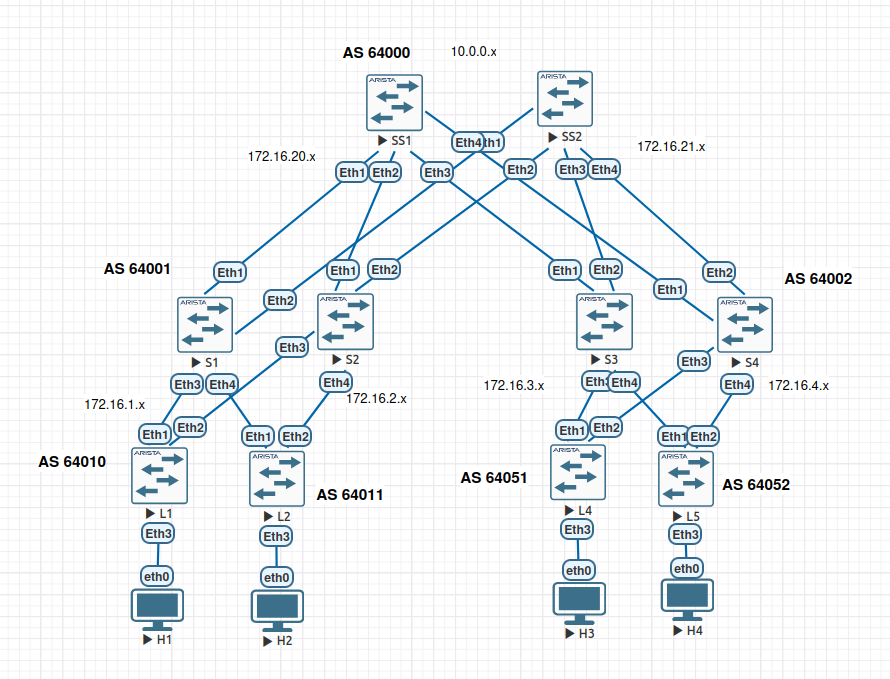
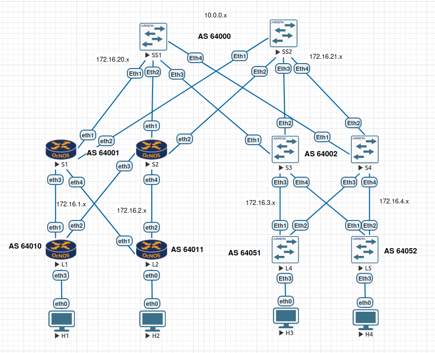

# Проектная работа «Построение фабрики VXLAN/EVPN для двух POD с использованием оборудования разных вендоров»

## Цель и задачи работы

Цель проектной работы: проверить взаимодействие сетевых операционных систем
разных вендоров.

Задачи:

1. Спроектировать сеть датацентра из двух подов.
2. Настроить оборудование на Arista vEOS.
3. Заменить один из подов на IP Infusion OcNOS.
4. Проверить работоспособность сети.

## Презентация

Презентация с основными итогами работы:

* [PowerPoint](./Otus_Neteng_DC_Zheldak.pptx);
* [PDF](./Otus_Neteng_DC_Zheldak.pdf);

## Содержание

* [1. Топология сети](#1-топология)
* [2. Адресный план](#2-адресный-план)
* [3. Настройка underlay](#3-настройка-underlay)
* [4. Настройка overlay L2 EVPN](#4-настройка-overlay-l2-evpn)
* [5. VxLAN EVPN](#5-vxlan-evpn)
* [6. Проверка работы](#6-проверка-работы)
* [7. Замена пода](#7-замена-пода)
* [8. Настройка пода на OcNOS](#8-настройка-пода-на-ocnos)
* [9. VxLAN EVPN на OcNOS](#9-настройка-overlay-vxlanevpn-на-ocnos)
* [10. Проверка работы гетерогенной сети](#10-проверка-работоспособности-гетерогенной-фабрики)

## 1. Топология

Топология лабораторного стенда собрана в среде EVE-NG и включает в себя:

POD1 (AS 64001):

* Спайны: S1, S2
* Лифы: L1, L2
* Клиенты: H1 (VLAN10), H2 (VLAN20)

POD2 (AS 64002):

* Спайны: S3, S4
* Лифы: L4, L5
* Клиенты: H3 (VLAN30), H4 (VLAN40)

Суперспайны (AS 64000): SS1, SS2.



## 2. Адресный план

### Номера автономных систем

| Устройство       | AS           |
| ---------------- | ------------ |
| Super-Spine 1,2  | 64000        |
| Spine 1,2 (POD1) | 64001        |
| Leaf 1,2 (POD1)  | 64010, 64011 |
| Spine 3,4 (POD2) | 64002        |
| Leaf 4,5 (POD2)  | 64051, 64052 |

### IP-адреса лупбэков

| Узел | Underlay (Loopback0) | Overlay (Loopback1) |
| ---- | -------------------- | ------------------- |
| SS1  | 10.0.0.1/32          | 10.10.0.1/32        |
| SS2  | 10.0.0.2/32          | 10.10.0.2/32        |
| S1   | 10.0.0.3/32          | 10.10.0.3/32        |
| S2   | 10.0.0.4/32          | 10.10.0.4/32        |
| S3   | 10.0.0.5/32          | 10.10.0.5/32        |
| S4   | 10.0.0.6/32          | 10.10.0.6/32        |
| L1   | 10.0.0.7/32          | 10.10.0.7/32        |
| L2   | 10.0.0.8/32          | 10.10.0.8/32        |
| L4   | 10.0.0.10/32         | 10.10.0.10/32       |
| L5   | 10.0.0.11/32         | 10.10.0.11/32       |

P2P линки (маска /31):

* Суперспайны <-> Спайны: `172.16.20.x/23`, `172.16.21.x/23`
* Спайны <-> Лифы: `172.16.1.x/24`, `172.16.2.x/24`, `172.16.3.x/24`, `172.16.4.x/24`

### Клиентские сети и VNI

| Клиент    | VLAN | VNI    | L3 VNI | Подсеть        | Anycast GW    |
| --------- | ---- | ------ | ------ | -------------- | ------------- |
| H1 (POD1) | 10   | 100010 | 111111 | 192.168.1.0/24 | 192.168.1.254 |
| H2 (POD1) | 20   | 100020 | 111111 | 192.168.2.0/24 | 192.168.2.254 |
| H3 (POD2) | 30   | 100030 | 111111 | 192.168.3.0/24 | 192.168.3.254 |
| H4 (POD2) | 40   | 100040 | 111111 | 192.168.4.0/24 | 192.168.4.254 |

## 3. Настройка underlay

Для обеспечения IP-связности между всеми loopback-интерфейсами используется eBGP. 
Суперспайны находятся в AS 64000. Спайны каждого POD’а находятся в своей AS
(64001, 64002). Лифы имеют уникальные AS (64010, 64011 и т.д.).

Для упрощения конфигурации на спайнах используются `peer-filter` и `listen range`.

### Конфигурация спайна (S1)

```text
router bgp 64001
  router-id 10.0.0.3
  no bgp default ipv4-unicast
  maximum-paths 2
  neighbor UNDERLAY peer group
  bgp listen range 172.16.0.0/20 peer-group UNDERLAY peer-filter LEAVES_ASN
  address-family ipv4
    neighbor UNDERLAY activate
    network 10.0.0.3/32
  exit
exit
peer-filter LEAVES_ASN
  10 match as-range 64010-64050 result accept
exit
do wr
```

### Конфигурация лифа (L1)

```text
router bgp 64010
  router-id 10.0.0.7
  no bgp default ipv4-unicast
  neighbor UNDERLAY peer group
  neighbor UNDERLAY remote-as 64001
  neighbor 172.16.1.0 peer group UNDERLAY
  neighbor 172.16.2.0 peer group UNDERLAY
  address-family ipv4
    neighbor UNDERLAY activate
    network 10.0.0.7/32
  exit
exit
do wr
```

### Конфигурация суперспайна (SS1)

```text
router bgp 64000
  router-id 10.0.0.1
  no bgp default ipv4-unicast
  maximum-paths 10
  neighbor UNDERLAY peer group
  bgp listen range 172.16.20.0/23 peer-group UNDERLAY peer-filter PODS_ASN
  address-family ipv4
    neighbor UNDERLAY activate
    network 10.0.0.1/32
  exit
exit
peer-filter PODS_ASN
  10 match as-range 64001-64010 result accept
exit
do wr
```

### Связь спайнов с суперспайнами

```text
enable
conf t
router bgp 64001
neighbor UNDERLAY_SSP peer group
neighbor UNDERLAY_SSP remote-as 64000
neighbor 172.16.20.0 peer group UNDERLAY_SSP
neighbor 172.16.21.0 peer group UNDERLAY_SSP
!neighbor 172.16.20.0 allowas-in 1
!neighbor 172.16.21.0 allowas-in 1
address-family ipv4
  neighbor UNDERLAY_SSP activate
end
wr
```

## 4. Настройка overlay L2 EVPN

### Конфигурация спайна (S1)

```text
service routing protocols model multi-agent
router bgp 64001
  neighbor EVPN peer group
  bgp listen range 10.10.0.0/16 peer-group EVPN peer-filter LEAVES_ASN
  neighbor EVPN next-hop-unchanged
  neighbor EVPN update-source Loopback1
  neighbor EVPN ebgp-multihop 3
  neighbor EVPN send-community extended
  neighbor 10.10.0.1 peer group EVPN
  neighbor 10.10.0.2 peer group EVPN
  address-family ipv4
    network 10.10.0.3/32
  exit
  address-family evpn
    neighbor EVPN activate
  exit
exit
do wr
```

### Конфигурация лифа (L1)

```text
service routing protocols model multi-agent
router bgp 64010
  neighbor EVPN peer group
  neighbor EVPN remote-as 64001
  neighbor EVPN next-hop-unchanged
  neighbor EVPN update-source lo1
  neighbor EVPN ebgp-multihop 3
  neighbor EVPN send-community extended
  neighbor 10.10.0.3 peer group EVPN
  neighbor 10.10.0.4 peer group EVPN
  address-family ipv4
    network 10.10.0.7/32
  exit
  address-family evpn
    neighbor EVPN activate
  exit
exit
do wr
```

### Конфигурация суперспайна (SS1)

```text
service routing protocols model multi-agent
router bgp 64000
  neighbor EVPN peer group
  bgp listen range 10.10.0.0/16 peer-group EVPN peer-filter PODS_ASN
  neighbor EVPN next-hop-unchanged
  neighbor EVPN update-source Loopback1
  neighbor EVPN ebgp-multihop 3
  neighbor EVPN send-community extended
  address-family ipv4
    network 10.10.0.1/32
  exit
  address-family evpn
    neighbor EVPN activate
  exit
exit
do wr
```

## 5. VxLAN EVPN

### Базовые настройки на лифах

Создадим VLAN, VRF, интерфейс Vxlan1, Anycast gateway. На каждом лифе будет своя
VLAN и хостовая сеть.

L1:

```text
en
conf t
vlan 10
exit
vrf instance VRF1
ip routing vrf VRF1
ip virtual-router mac-address ca:fe:ba:be:00:00
interface Vlan10
  vrf VRF1
  ip address 192.168.1.201/24
  ip virtual-router address 192.168.1.254
  exit
interface Vxlan1
  vxlan source-interface Loopback1
  vxlan udp-port 4789
  vxlan vlan 10 vni 100010
  vxlan vlan 20 vni 100020
  vxlan vrf VRF1 vni 111111
  vxlan learn-restrict any
end
wr
```

### Настройка EVPN на лифах

Активируем соседство EVPN со спайнами, настроим RD/RT для VLAN и VRF.

L1:

```text
router bgp 64010
  vlan 10
    rd auto
    route-target both 10:100010
    redistribute learned
  exit
  vlan 20
    rd auto
    route-target both 20:100020
    redistribute learned
  exit
  vrf VRF1
    rd 64010:1
    route-target import evpn 1:111111
    route-target export evpn 1:111111
    redistribute connected
end
wr
```

## 6. Проверка работы

### Проверка BGP соседства

На лифе L1:

```text
L1#show bgp summary 
BGP summary information for VRF default
Router identifier 10.0.0.7, local AS number 64010
Neighbor            AS Session State AFI/SAFI                AFI/SAFI State   NLRI Rcd   NLRI Acc   NLRI Adv
---------- ----------- ------------- ----------------------- -------------- ---------- ---------- ----------
10.10.0.3        64001 Established   L2VPN EVPN              Negotiated              6          6          6
10.10.0.4        64001 Established   L2VPN EVPN              Negotiated              6          6          4
172.16.1.0       64001 Established   IPv4 Unicast            Negotiated             16         16         14
172.16.2.0       64001 Established   IPv4 Unicast            Negotiated             16         16          8
L1#
```

```text
L1#show bgp evpn summary 
BGP summary information for VRF default
Router identifier 10.0.0.7, local AS number 64010
Neighbor Status Codes: m - Under maintenance
  Neighbor  V AS           MsgRcvd   MsgSent  InQ OutQ  Up/Down State   PfxRcd PfxAcc PfxAdv
  10.10.0.3 4 64001            172       172    0    0 02:18:25 Estab   6      6      6
  10.10.0.4 4 64001            172       171    0    0 02:18:21 Estab   6      6      4
L1#
```

Видим, что соседство установилось с обоих адресных семействах, префиксы приходят.

На суперспайне SS1:

```text
SS1#show bgp summary 
BGP summary information for VRF default
Router identifier 10.0.0.1, local AS number 64000
Neighbor             AS Session State AFI/SAFI                AFI/SAFI State   NLRI Rcd   NLRI Acc   NLRI Adv
----------- ----------- ------------- ----------------------- -------------- ---------- ---------- ----------
10.10.0.3         64001 Established   L2VPN EVPN              Negotiated              4          4          8
10.10.0.4         64001 Established   L2VPN EVPN              Negotiated              4          4          4
10.10.0.5         64002 Established   L2VPN EVPN              Negotiated              4          4          4
10.10.0.6         64002 Established   L2VPN EVPN              Negotiated              4          4          8
172.16.20.1       64001 Established   IPv4 Unicast            Negotiated              6          6         16
172.16.20.3       64001 Established   IPv4 Unicast            Negotiated              6          6         12
172.16.20.5       64002 Established   IPv4 Unicast            Negotiated              6          6         12
172.16.20.7       64002 Established   IPv4 Unicast            Negotiated              6          6         16
SS1#
```

```text
SS1#show bgp evpn summary
BGP summary information for VRF default
Router identifier 10.0.0.1, local AS number 64000
Neighbor Status Codes: m - Under maintenance
  Neighbor  V AS           MsgRcvd   MsgSent  InQ OutQ  Up/Down State   PfxRcd PfxAcc PfxAdv
  10.10.0.3 4 64001            175       180    0    0 02:22:47 Estab   4      4      8
  10.10.0.4 4 64001            174       174    0    0 02:22:50 Estab   4      4      4
  10.10.0.5 4 64002            175       175    0    0 02:22:50 Estab   4      4      4
  10.10.0.6 4 64002            175       182    0    0 02:22:50 Estab   4      4      8
SS1#
```

Здесь также всё поднялось.

### Проверка таблицы VXLAN VNI

L1:

```text
L1#show vxlan vni
VNI to VLAN Mapping for Vxlan1
VNI          VLAN       Source       Interface       802.1Q Tag
------------ ---------- ------------ --------------- ----------
100010       10         static       Ethernet3       untagged  
                                     Vxlan1          10        

VNI to dynamic VLAN Mapping for Vxlan1
VNI          VLAN       VRF        Source       
------------ ---------- ---------- ------------ 
111111       4097       VRF1       evpn         

L1#
```

### Проверка связности между клиентами

Пинг с H1 (POD1) на H4 (POD2):

```text
H1> ping 192.168.4.1

84 bytes from 192.168.4.1 icmp_seq=1 ttl=62 time=24.622 ms
^C
H1> 
```

### Проверка маршрутов EVPN

Для того, чтобы маки изучились пинганём с H4 H1.

L1:

```text
L1#show bgp evpn route-type mac-ip
BGP routing table information for VRF default
Router identifier 10.0.0.7, local AS number 64010
Route status codes: * - valid, > - active, S - Stale, E - ECMP head, e - ECMP
                    c - Contributing to ECMP, % - Pending best path selection
Origin codes: i - IGP, e - EGP, ? - incomplete
AS Path Attributes: Or-ID - Originator ID, C-LST - Cluster List, LL Nexthop - Link Local Nexthop

          Network                Next Hop              Metric  LocPref Weight  Path
 * >Ec    RD: 10.0.0.11:40 mac-ip 0050.7966.680c
                                 10.10.0.11            -       100     0       64001 64000 64002 64052 i
 *  ec    RD: 10.0.0.11:40 mac-ip 0050.7966.680c
                                 10.10.0.11            -       100     0       64001 64000 64002 64052 i
 * >Ec    RD: 10.0.0.11:40 mac-ip 0050.7966.680c 192.168.4.1
                                 10.10.0.11            -       100     0       64001 64000 64002 64052 i
 *  ec    RD: 10.0.0.11:40 mac-ip 0050.7966.680c 192.168.4.1
                                 10.10.0.11            -       100     0       64001 64000 64002 64052 i
 * >      RD: 10.0.0.7:10 mac-ip 0050.7966.680d
                                 -                     -       -       0       i
 * >      RD: 10.0.0.7:10 mac-ip 0050.7966.680d 192.168.1.1
                                 -                     -       -       0       i
L1#
```

Видим MAC-IP адреса клиентов из обоих подов, изученные через BGP EVPN.

### Полная таблица BGP EVPN

На лифе L1:

<details>
<summary>Вывод команды show bgp evpn</summary>

```text
L1#show bgp evpn 
BGP routing table information for VRF default
Router identifier 10.0.0.7, local AS number 64010
Route status codes: * - valid, > - active, S - Stale, E - ECMP head, e - ECMP
                    c - Contributing to ECMP, % - Pending best path selection
Origin codes: i - IGP, e - EGP, ? - incomplete
AS Path Attributes: Or-ID - Originator ID, C-LST - Cluster List, LL Nexthop - Link Local Nexthop

          Network                Next Hop              Metric  LocPref Weight  Path
 * >Ec    RD: 10.0.0.11:40 mac-ip 0050.7966.680c
                                 10.10.0.11            -       100     0       64001 64000 64002 64052 i
 *  ec    RD: 10.0.0.11:40 mac-ip 0050.7966.680c
                                 10.10.0.11            -       100     0       64001 64000 64002 64052 i
 * >Ec    RD: 10.0.0.11:40 mac-ip 0050.7966.680c 192.168.4.1
                                 10.10.0.11            -       100     0       64001 64000 64002 64052 i
 *  ec    RD: 10.0.0.11:40 mac-ip 0050.7966.680c 192.168.4.1
                                 10.10.0.11            -       100     0       64001 64000 64002 64052 i
 * >      RD: 10.0.0.7:10 mac-ip 0050.7966.680d
                                 -                     -       -       0       i
 * >      RD: 10.0.0.7:10 mac-ip 0050.7966.680d 192.168.1.1
                                 -                     -       -       0       i
 * >      RD: 10.0.0.7:10 imet 10.10.0.7
                                 -                     -       -       0       i
 * >Ec    RD: 10.0.0.8:20 imet 10.10.0.8
                                 10.10.0.8             -       100     0       64001 64011 i
 *  ec    RD: 10.0.0.8:20 imet 10.10.0.8
                                 10.10.0.8             -       100     0       64001 64011 i
 * >Ec    RD: 10.0.0.10:30 imet 10.10.0.10
                                 10.10.0.10            -       100     0       64001 64000 64002 64051 i
 *  ec    RD: 10.0.0.10:30 imet 10.10.0.10
                                 10.10.0.10            -       100     0       64001 64000 64002 64051 i
 * >Ec    RD: 10.0.0.11:40 imet 10.10.0.11
                                 10.10.0.11            -       100     0       64001 64000 64002 64052 i
 *  ec    RD: 10.0.0.11:40 imet 10.10.0.11
                                 10.10.0.11            -       100     0       64001 64000 64002 64052 i
 * >      RD: 64010:1 ip-prefix 192.168.1.0/24
                                 -                     -       -       0       i
 * >Ec    RD: 64011:1 ip-prefix 192.168.2.0/24
                                 10.10.0.8             -       100     0       64001 64011 i
 *  ec    RD: 64011:1 ip-prefix 192.168.2.0/24
                                 10.10.0.8             -       100     0       64001 64011 i
 * >Ec    RD: 64051:1 ip-prefix 192.168.3.0/24
                                 10.10.0.10            -       100     0       64001 64000 64002 64051 i
 *  ec    RD: 64051:1 ip-prefix 192.168.3.0/24
                                 10.10.0.10            -       100     0       64001 64000 64002 64051 i
 * >Ec    RD: 64052:1 ip-prefix 192.168.4.0/24
                                 10.10.0.11            -       100     0       64001 64000 64002 64052 i
 *  ec    RD: 64052:1 ip-prefix 192.168.4.0/24
                                 10.10.0.11            -       100     0       64001 64000 64002 64052 i
L1#
```

</details>

### Таблица IP маршрутизации

L1:

<details>
<summary>Вывод команды show ip route</summary>

```text
L1#show ip route

VRF: default
Source Codes:
       C - connected, S - static, K - kernel,
       O - OSPF, O IA - OSPF inter area, O E1 - OSPF external type 1,
       O E2 - OSPF external type 2, O N1 - OSPF NSSA external type 1,
       O N2 - OSPF NSSA external type2, O3 - OSPFv3,
       O3 IA - OSPFv3 inter area, O3 E1 - OSPFv3 external type 1,
       O3 E2 - OSPFv3 external type 2,
       O3 N1 - OSPFv3 NSSA external type 1,
       O3 N2 - OSPFv3 NSSA external type2, B - Other BGP Routes,
       B I - iBGP, B E - eBGP, R - RIP, I L1 - IS-IS level 1,
       I L2 - IS-IS level 2, A B - BGP Aggregate,
       A O - OSPF Summary, NG - Nexthop Group Static Route,
       V - VXLAN Control Service, M - Martian,
       DH - DHCP client installed default route,
       DP - Dynamic Policy Route, L - VRF Leaked,
       G  - gRIBI, RC - Route Cache Route,
       CL - CBF Leaked Route

Gateway of last resort is not set

 B E      10.0.0.1/32 [200/0]
           via 172.16.1.0, Ethernet1
           via 172.16.2.0, Ethernet2
 B E      10.0.0.2/32 [200/0]
           via 172.16.1.0, Ethernet1
           via 172.16.2.0, Ethernet2
 B E      10.0.0.3/32 [200/0]
           via 172.16.1.0, Ethernet1
 B E      10.0.0.4/32 [200/0]
           via 172.16.2.0, Ethernet2
 B E      10.0.0.5/32 [200/0]
           via 172.16.1.0, Ethernet1
           via 172.16.2.0, Ethernet2
 B E      10.0.0.6/32 [200/0]
           via 172.16.1.0, Ethernet1
           via 172.16.2.0, Ethernet2
 C        10.0.0.7/32
           directly connected, Loopback0
 B E      10.0.0.8/32 [200/0]
           via 172.16.1.0, Ethernet1
           via 172.16.2.0, Ethernet2
 B E      10.0.0.10/32 [200/0]
           via 172.16.1.0, Ethernet1
           via 172.16.2.0, Ethernet2
 B E      10.0.0.11/32 [200/0]
           via 172.16.1.0, Ethernet1
           via 172.16.2.0, Ethernet2
 B E      10.10.0.1/32 [200/0]
           via 172.16.1.0, Ethernet1
           via 172.16.2.0, Ethernet2
 B E      10.10.0.2/32 [200/0]
           via 172.16.1.0, Ethernet1
           via 172.16.2.0, Ethernet2
 B E      10.10.0.3/32 [200/0]
           via 172.16.1.0, Ethernet1
 B E      10.10.0.4/32 [200/0]
           via 172.16.2.0, Ethernet2
 B E      10.10.0.5/32 [200/0]
           via 172.16.1.0, Ethernet1
           via 172.16.2.0, Ethernet2
 B E      10.10.0.6/32 [200/0]
           via 172.16.1.0, Ethernet1
           via 172.16.2.0, Ethernet2
 C        10.10.0.7/32
           directly connected, Loopback1
 B E      10.10.0.8/32 [200/0]
           via 172.16.1.0, Ethernet1
           via 172.16.2.0, Ethernet2
 B E      10.10.0.10/32 [200/0]
           via 172.16.1.0, Ethernet1
           via 172.16.2.0, Ethernet2
 B E      10.10.0.11/32 [200/0]
           via 172.16.1.0, Ethernet1
           via 172.16.2.0, Ethernet2
 C        172.16.1.0/31
           directly connected, Ethernet1
 C        172.16.2.0/31
           directly connected, Ethernet2

L1#
```

</details>

## 7. Замена пода

Удалим первый под и на его месте соберём новый, с такой же топологией и настройками,
но на базе OcNOS 6.6.1 от IP Infusion.

POD1 (AS 64001) — заменён на OcNOS:

* Спайны: S1, S2 (OcNOS)
* Лифы: L1, L2 (OcNOS)
* Клиенты: H1 (VLAN10), H2 (VLAN20)

POD2 (AS 64002) — остался на Arista vEOS:

* Спайны: S3, S4 (Arista)
* Лифы: L4, L5 (Arista)
* Клиенты: H3 (VLAN30), H4 (VLAN40)

Суперспайны (AS 64000): SS1, SS2 (Arista) — без изменений



## 8. Настройка пода на OcNOS

### Назначение IP-адресов

В Окнос другие названия интерфейсов, они реестрозависимы. Также приходится делать
commit.

Лиф L1

```text
en
conf t
interface eth1
   ip address 172.16.1.1/31
interface eth2
   ip address 172.16.2.1/31
interface loopback1
   ip address 10.0.0.7/32
interface loopback2
   ip address 10.10.0.7/32
commit
end
wr
```

Спайн S1

```text
en
conf t
interface loopback1
  ip address 10.0.0.3/32
interface loopback2
  ip address 10.10.0.3/32
interface eth1
  ip address 172.16.20.1/31
interface eth2
  ip address 172.16.21.1/31
interface eth3
  ip address 172.16.1.0/31
interface eth4
  ip address 172.16.1.2/31
commit
end
wr
```

### Настройка eBGP underlay

Конфигурации, которые нашёл в документации и видео, построены по схеме iBGP между
спайнами, iBGP между лифами пода, eBGP между AS спайнов и лифов. Тем не менее ради
единообразия настроим под также, как и на Аристе.

Лиф L1

```text
router bgp 64010
 bgp router-id 10.0.0.7
 neighbor UNDERLAY peer-group
 neighbor UNDERLAY remote-as 64001
 neighbor 172.16.1.0 peer-group UNDERLAY
 neighbor 172.16.2.0 peer-group UNDERLAY

 address-family ipv4 unicast
   network 10.0.0.7/32
   max-paths ebgp 4
   neighbor UNDERLAY activate
 exit-address-family
```

Спайн S1

Динамические нейборы (пир группа со списком AS-path) в Ocnos 6.6 не поддерживаются,
поэтому соседство с лифами придётся поднимать вручную.

```text
router bgp 64001
 bgp router-id 10.0.0.3
 neighbor UNDERLAY_SSP peer-group
 neighbor UNDERLAY_SSP remote-as 64000
 neighbor 172.16.20.0 peer-group UNDERLAY_SSP
 neighbor 172.16.21.0 peer-group UNDERLAY_SSP
 neighbor 10.10.0.7 remote-as 64010
 neighbor 10.10.0.7 ebgp-multihop 10
 neighbor 10.10.0.7 update-source loopback2
 neighbor 10.10.0.8 remote-as 64011
 neighbor 10.10.0.8 ebgp-multihop 10
 neighbor 10.10.0.8 update-source loopback2
 neighbor 172.16.1.1 remote-as 64010
 neighbor 172.16.1.3 remote-as 64011

 address-family ipv4 unicast
   network 10.0.0.3/32
   max-paths ebgp 4
   neighbor UNDERLAY_SSP activate
   neighbor 172.16.1.1 activate
   neighbor 172.16.1.3 activate
   redistribute connected
 exit-address-family
```

### Настройка eBGP overlay

L1:

```text
router bgp 64010
  neighbor EVPN peer-group
  neighbor EVPN remote-as 64001
  neighbor EVPN ebgp-multihop 10
  neighbor EVPN update-source loopback2
  neighbor 10.10.0.3 peer-group EVPN
  neighbor 10.10.0.4 peer-group EVPN

  address-family ipv4 unicast
    network 10.10.0.7/32
    max-paths ebgp 4
    redistribute connected
  exit-address-family

 address-family l2vpn evpn
   neighbor EVPN activate
 exit-address-family
```

S1:

```text
router bgp 64001
  no bgp inbound-route-filter
  neighbor EVPN_SSP peer-group
  neighbor EVPN_SSP remote-as 64000
  neighbor EVPN_SSP ebgp-multihop 10
  neighbor EVPN_SSP update-source loopback2
  neighbor 10.10.0.1 peer-group EVPN_SSP
  neighbor 10.10.0.2 peer-group EVPN_SSP
  neighbor 10.10.0.7 remote-as 64010
  neighbor 10.10.0.7 ebgp-multihop 10
  neighbor 10.10.0.7 update-source loopback2
  neighbor 10.10.0.8 remote-as 64011
  neighbor 10.10.0.8 ebgp-multihop 10
  neighbor 10.10.0.8 update-source loopback2

  address-family ipv4 unicast
    network 10.10.0.3/32
    max-paths ebgp 4
    redistribute connected
    neighbor 172.16.1.1 activate
    neighbor 172.16.1.3 activate
  exit-address-family

 address-family l2vpn evpn
   neighbor EVPN_SSP activate
   neighbor 10.10.0.7 activate
   neighbor 10.10.0.8 activate
 exit-address-family
```

На спайнах OcNOS пришлось добавить команду `no bgp inbound-route-filter`, т.к.
без неё не изучались маршруты EVPN.

## 9. Настройка Overlay VXLAN/EVPN на OcNOS

### Настройка MAC VRF и L3 VRF

В OcNOS концепция EVPN требует явного создания MAC VRF (для L2) и L3 VRF (для маршрутизации).

L1:

```text
mac vrf L2VRF1
  rd 64010:1
  route-target both 1:111111
ip vrf L3VRF1
  rd 64010:11
  route-target both 11:111111
  l3vni 1000
```

Также добавим редистрибьюцию маршрутов в L3VRF1

```text
 address-family ipv4 vrf L3VRF1
   redistribute connected
 exit-address-family
```

### Настройка VXLAN VTEP

На каждом лифе выполним команду `nvo vxlan enable` и перезагрузим устройства.

L1:

```text
nvo vxlan vtep-ip-global 10.10.0.7

nvo vxlan id 100010 ingress-replication inner-vid-disabled 
  vxlan host-reachability-protocol evpn-bgp L2VRF1
```

### Настройка Anycast Gateway

L1:

```text
nvo vxlan irb

interface irb10010
  ip vrf forwarding L3VRF1
  evpn irb-if-forwarding anycast-gateway-mac
  ip address 192.168.1.254/24 anycast

nvo vxlan id 100010 ingress-replication inner-vid-disabled 
  evpn irb10010

evpn irb-forwarding anycast-gateway-mac cafe.babe.0000
```

### Настройка access-порта

Настроить access порт для работы совместно с VxLAN мне так и не удалось, как потом
выяснилось, это было связано с ограничениями образа VM OcNOS. Поэтому приведённые
здесь настройки могут быть избыточными или некорректными.

L1:

```text
bridge 1 protocol ieee vlan-bridge
vlan database
  vlan 10 bridge 1 state enable

interface eth3
  switchport
  bridge-group 1 spanning-tree disable
  switchport mode hybrid
nvo vxlan access-if port-vlan eth3 10
  map vnid 100010
  mac 0000.0000.1111
```

Здесь важна команда `mac 0000.0000.1111` которая добавляет статический MAC. В
реальном конфиге она скорее всего не потребуется. Здесь мы её используем чтобы
проверить распространение маков, т.к. подключение хостов не работает.

## 10. Проверка работоспособности гетерогенной фабрики

### Проверка BGP соседств

L1:

```text
L1#show bgp summary 
BGP router identifier 10.0.0.7, local AS number 64010
BGP table version is 5
7 BGP AS-PATH entries
0 BGP community entries
4  Configured ebgp ECMP multipath: Currently set at 4

Neighbor           V    AS     MsgRcv     MsgSen  TblVer    InQ   OutQ   Up/Down
  State/PfxRcd   Desc
172.16.1.0         4 64001         87         89       5      0      0  00:32:17
            21
172.16.2.0         4 64001         87         84       5      0      0  00:32:19
            21

Total number of neighbors 2

Total number of Established sessions 2
L1#
```

```text
L1#show bgp l2vpn evpn summary 
BGP router identifier 10.0.0.7, local AS number 64010
BGP table version is 5
7 BGP AS-PATH entries
0 BGP community entries

Neighbor          V    AS     MsgRcv     MsgSen  TblVer    InQ   OutQ   Up/Down 
 State/PfxRcd     AD  MACIP  MCAST    ESI  PREFIX-ROUTE  Desc
10.10.0.3          4 64001         83         81       5      0      0  00:32:27
             4      0      1      1      0      2
10.10.0.4          4 64001         85         86       5      0      0  00:32:34
             4      0      1      1      0      2

Total number of neighbors 2

Total number of Established sessions 2
L1#
```

Видим, что на лифе BGP соседства поднялись.

Спайн S1:

```text
S1#show bgp summ
BGP router identifier 10.0.0.3, local AS number 64001
BGP table version is 5
7 BGP AS-PATH entries
0 BGP community entries
4  Configured ebgp ECMP multipath: Currently set at 4

Neighbor           V    AS     MsgRcv     MsgSen  TblVer    InQ   OutQ   Up/Down
  State/PfxRcd   Desc
172.16.1.1         4 64010         93         93       5      0      0  00:34:47
             4
172.16.1.3         4 64011         91         90       5      0      0  00:34:47
             4
172.16.20.0        4 64000         94         88       5      0      0  00:33:57
            10
172.16.21.0        4 64000         91         92       5      0      0  00:33:56
            10

Total number of neighbors 4

Total number of Established sessions 4
S1#
```

```text
S1#show bgp l2vpn evpn summ
BGP router identifier 10.0.0.3, local AS number 64001
BGP table version is 6
7 BGP AS-PATH entries
0 BGP community entries

Neighbor          V    AS     MsgRcv     MsgSen  TblVer    InQ   OutQ   Up/Down 
 State/PfxRcd     AD  MACIP  MCAST    ESI  PREFIX-ROUTE  Desc
10.10.0.1          4 64000         88         91       6      0      0  00:33:33
             4      0      0      2      0      2
10.10.0.2          4 64000         87         86       6      0      0  00:34:05
             4      0      0      2      0      2
10.10.0.7          4 64010         84         88       6      0      0  00:34:25
             3      0      1      1      0      1
10.10.0.8          4 64011         86         90       6      0      0  00:34:30
             2      0      1      1      0      0

Total number of neighbors 4

Total number of Established sessions 4
S1#
```

Спайн также видит и свои лифы и суперспайны.

### Просмотр VXLAN VTEP таблицы на лифе L1 (OcNOS)

```text
L1>show nvo vxlan 
VXLAN Information 
================= 
   Codes: NW - Network Port 
          AC - Access Port 
         (u) - Untagged 

VNID     VNI-Name     VNI-Type Type Interface ESI                           VLAN
      DF-Status Src-Addr         Dst-Addr         Router-Mac      
________________________________________________________________________________
_______________________________________________________________
100010   ----         L2       NW   ----      ----                          ----
      ----      10.10.0.7        10.10.0.8       
100010   ----         --       AC   eth3      --- Single Homed Port ---     10  
      ----      ----             ----            

Total number of entries are 2 
L1>
```

### Просмотр изученных через EVPN MAC-адресов  на лифе L1 (OcNOS)

```text
L1>show nvo vxlan mac-table 
================================================================================
================================================================================
=
                                                     VXLAN MAC Entries 
================================================================================
================================================================================
=
VNID       Interface VlanId    In-VlanId Mac-Addr       VTEP-Ip/ESI             
                      Type            Status     MAC move AccessPortDesc LeafFla
g  
________________________________________________________________________________
________________________________________________________________________________
_

100010     eth3      10        ----      0000.0000.1111 10.10.0.7               
                      Static Local    -------    0        -------          ---- 
   
100010     ----      ----      ----      0000.0000.2222 10.10.0.8               
                      Static Remote   -------    0        -------          ---- 
   

Total number of entries are : 2

L1>

```

Видим оба статических мака: свой локальный и удалённый, со второго лифа.

### Вывод EVPN маршрутов

На лифе L1:

<details>
<summary>show bgp l2vpn evpn</summary>

```text
L1#show bgp l2vpn evpn 
BGP table version is 5, local router ID is 10.0.0.7
Status codes: s suppressed, d damped, h history, a add-path, b back-up, * valid,
 > best, i - internal,
              l - labeled, S Stale
Origin codes: i - IGP, e - EGP, ? - incomplete
Description : Ext-Color - Extended community color

[EVPN route type]:[ESI]:[VNID]:[relevent route informantion]
1 - Ethernet Auto-discovery Route
2 - MAC/IP Route
3 - Inclusive Multicast Route
4 - Ethernet Segment Route
5 - Prefix Route

    Network          Next Hop            Metric    LocPrf	Weight     Path 
 Peer          Encap

RD[64010:1] VRF[L2VRF1]:
*>   [2]:[0]:[100010]:[48,0000:0000:1111]:[0]:[100010]
                       10.10.0.7            0        100       32768  i        -
  ----------      VXLAN     
*    [2]:[0]:[100010]:[48,0000:0000:2222]:[0]:[100010]
                       10.10.0.8            0        100       0   64001 64011 i
        -  10.10.0.3       VXLAN     
*>   [3]:[100010]:[32,10.10.0.7]
                       10.10.0.7            0        100       32768  i        -
  ----------      VXLAN     
*    [3]:[100010]:[32,10.10.0.8]
                       10.10.0.8            0        100       0   64001 64011 i
        -  10.10.0.3       VXLAN     
*    [5]:[0]:[0]:[24]:[192.168.3.0]:[0.0.0.0]:[111111]
                       10.10.0.10           0        100       0   64001 64000 6
4002 64051 i        -  10.10.0.3       VXLAN     
*    [5]:[0]:[0]:[24]:[192.168.4.0]:[0.0.0.0]:[111111]
                       10.10.0.11           0        100       0   64001 64000 6
4002 64052 i        -  10.10.0.3       VXLAN     

RD[64011:1]
*>   [2]:[0]:[100010]:[48,0000:0000:2222]:[0]:[100010]
                       10.10.0.8            0        100       0   64001 64011 i
        -  10.10.0.3       VXLAN     
*                      10.10.0.8            0        100       0   64001 64011 i
        -  10.10.0.4       VXLAN     
*>   [3]:[100010]:[32,10.10.0.8]
                       10.10.0.8            0        100       0   64001 64011 i
        -  10.10.0.3       VXLAN     
*                      10.10.0.8            0        100       0   64001 64011 i
        -  10.10.0.4       VXLAN     

RD[64051:1]
*>   [5]:[0]:[0]:[24]:[192.168.3.0]:[0.0.0.0]:[111111]
                       10.10.0.10           0        100       0   64001 64000 6
4002 64051 i        -  10.10.0.3       VXLAN     
*                      10.10.0.10           0        100       0   64001 64000 6
4002 64051 i        -  10.10.0.4       VXLAN     

RD[64052:1]
*>   [5]:[0]:[0]:[24]:[192.168.4.0]:[0.0.0.0]:[111111]
                       10.10.0.11           0        100       0   64001 64000 6
4002 64052 i        -  10.10.0.3       VXLAN     
*                      10.10.0.11           0        100       0   64001 64000 6
4002 64052 i        -  10.10.0.4       VXLAN     

Total number of prefixes 10
L1#
```

</details>

Лиф L5:

<details>
<summary>show bgp evpn</summary>

```text
L5#show bgp evpn 
BGP routing table information for VRF default
Router identifier 10.0.0.11, local AS number 64052
Route status codes: * - valid, > - active, S - Stale, E - ECMP head, e - ECMP
                    c - Contributing to ECMP, % - Pending best path selection
Origin codes: i - IGP, e - EGP, ? - incomplete
AS Path Attributes: Or-ID - Originator ID, C-LST - Cluster List, LL Nexthop - Link Local Nexthop

          Network                Next Hop              Metric  LocPref Weight  Path
 * >Ec    RD: 64010:1 mac-ip 100010 0000.0000.1111
                                 10.10.0.7             -       100     0       64002 64000 64001 64010 i
 *  ec    RD: 64010:1 mac-ip 100010 0000.0000.1111
                                 10.10.0.7             -       100     0       64002 64000 64001 64010 i
 * >Ec    RD: 64011:1 mac-ip 100010 0000.0000.2222
                                 10.10.0.8             -       100     0       64002 64000 64001 64011 i
 *  ec    RD: 64011:1 mac-ip 100010 0000.0000.2222
                                 10.10.0.8             -       100     0       64002 64000 64001 64011 i
 * >Ec    RD: 10.0.0.10:30 imet 10.10.0.10
                                 10.10.0.10            -       100     0       64002 64051 i
 *  ec    RD: 10.0.0.10:30 imet 10.10.0.10
                                 10.10.0.10            -       100     0       64002 64051 i
 * >      RD: 10.0.0.11:40 imet 10.10.0.11
                                 -                     -       -       0       i
 * >Ec    RD: 64010:1 imet 100010 10.10.0.7
                                 10.10.0.7             -       100     0       64002 64000 64001 64010 i
 *  ec    RD: 64010:1 imet 100010 10.10.0.7
                                 10.10.0.7             -       100     0       64002 64000 64001 64010 i
 * >Ec    RD: 64011:1 imet 100010 10.10.0.8
                                 10.10.0.8             -       100     0       64002 64000 64001 64011 i
 *  ec    RD: 64011:1 imet 100010 10.10.0.8
                                 10.10.0.8             -       100     0       64002 64000 64001 64011 i
 * >Ec    RD: 64010:11 ip-prefix 192.168.1.0/24
                                 10.10.0.7             -       100     0       64002 64000 64001 64010 ?
 *  ec    RD: 64010:11 ip-prefix 192.168.1.0/24
                                 10.10.0.7             -       100     0       64002 64000 64001 64010 ?
 * >Ec    RD: 64051:1 ip-prefix 192.168.3.0/24
                                 10.10.0.10            -       100     0       64002 64051 i
 *  ec    RD: 64051:1 ip-prefix 192.168.3.0/24
                                 10.10.0.10            -       100     0       64002 64051 i
 * >      RD: 64052:1 ip-prefix 192.168.4.0/24
                                 -                     -       -       0       i
L5#
```

</details>

### Проверка маршрутов VRF на лифе L1 (OcNOS)

```text
L1#show ip route vrf L2VRF1

Gateway of last resort is not set
L1#show ip route vrf L3VRF1
Codes: K - kernel, C - connected, S - static, R - RIP, B - BGP
       O - OSPF, IA - OSPF inter area
       N1 - OSPF NSSA external type 1, N2 - OSPF NSSA external type 2
       E1 - OSPF external type 1, E2 - OSPF external type 2
       i - IS-IS, L1 - IS-IS level-1, L2 - IS-IS level-2,
       ia - IS-IS inter area, E - EVPN,
       v - vrf leaked 
       * - candidate default

IP Route Table for VRF "L3VRF1"
C            192.168.1.0/24 is directly connected, irb10010, installed 01:07:01,
 last update 01:07:01 ago

Gateway of last resort is not set
L1#
```

Здесь мы должны были увидеть маршруты до клиентских подсетей 192.168.2.0/24
(POD1) и 192.168.3.0/24, 192.168.4.0/24 (POD2). Однако почему-то видим только
свою подсеть. Со второго лифа нет маршрута. Вероятно что-то не так с настрйоками.

Вот как это выглядит (корректно) на лифе L5 (vEOS):

```
L5#show ip route vrf VRF1

VRF: VRF1
Source Codes:
       C - connected, S - static, K - kernel,
       O - OSPF, O IA - OSPF inter area, O E1 - OSPF external type 1,
       O E2 - OSPF external type 2, O N1 - OSPF NSSA external type 1,
       O N2 - OSPF NSSA external type2, O3 - OSPFv3,
       O3 IA - OSPFv3 inter area, O3 E1 - OSPFv3 external type 1,
       O3 E2 - OSPFv3 external type 2,
       O3 N1 - OSPFv3 NSSA external type 1,
       O3 N2 - OSPFv3 NSSA external type2, B - Other BGP Routes,
       B I - iBGP, B E - eBGP, R - RIP, I L1 - IS-IS level 1,
       I L2 - IS-IS level 2, A B - BGP Aggregate,
       A O - OSPF Summary, NG - Nexthop Group Static Route,
       V - VXLAN Control Service, M - Martian,
       DH - DHCP client installed default route,
       DP - Dynamic Policy Route, L - VRF Leaked,
       G  - gRIBI, RC - Route Cache Route,
       CL - CBF Leaked Route

Gateway of last resort is not set

 B E      192.168.3.0/24 [200/0]
           via VTEP 10.10.0.10 VNI 111111 router-mac 50:00:00:af:d3:f6 local-interface Vxlan1
 C        192.168.4.0/24
           directly connected, Vlan40

L5#
```

Здесь мы видим, что удалённый маршрут пришёл через vxlan.

### Проверка сквозной связности

Как уже говорилось, связность между хостами проверить не получится из-за ограниченной
функциональности виртуального образа OcNOS. Но мы модем убедиться, что лупбэки лифов
пингуют друг друга.

Связность внутри POD1 (L1 -> L2):

```text
L1#ping 10.10.0.8 source-ip 10.10.0.7
Press CTRL+C to exit
PING 10.10.0.8 (10.10.0.8) from 10.10.0.7 : 100(128) bytes of data.
108 bytes from 10.10.0.8: icmp_seq=1 ttl=63 time=0.870 ms

--- 10.10.0.8 ping statistics ---
1 packets transmitted, 1 received, 0% packet loss, time 0ms
rtt min/avg/max/mdev = 0.870/0.870/0.870/0.000 ms
L1#
```

Связность между POD1 и POD2 (L1 -> L5):

```text
L1#ping 10.10.0.11 source-ip 10.10.0.7
Press CTRL+C to exit
PING 10.10.0.11 (10.10.0.11) from 10.10.0.7 : 100(128) bytes of data.
108 bytes from 10.10.0.11: icmp_seq=1 ttl=61 time=4.32 ms
108 bytes from 10.10.0.11: icmp_seq=2 ttl=61 time=3.78 ms

--- 10.10.0.11 ping statistics ---
2 packets transmitted, 2 received, 0% packet loss, time 1001ms
rtt min/avg/max/mdev = 3.778/4.049/4.321/0.271 ms
L1#
```

## Нерешённые проблемы

Как выяснилось в последний момент образ OcNOS для виртуальных машин не позволяет
подключать хосты (не реализован data forwarding) - https://www.youtube.com/watch?v=fzBbeYlrPX8
. Именно поэтому пришлось добавлять
в L3 VNI статический MAC. Также из-за этого не получилось проверить пинг между хостами
даже в пределах одного пода.

Также не совсем понятно, почему по BGP не пришли маршруты в L3VRF1 со второго лифа.
Изменение имени vrf на VRF1 также не привело к появлению маршрутов из 2-го пода.

## Выводы

В целом можно сказать, что интероперабельность на уровне подов внутри сети DC работает.
OcNOS имеет свои особенности, её синтаксис не такой привычный, как у Cisco или Arista.
Тем не менее основной функционал в ней присутствует.

## Файлы настроек

Файлы настроек устройств (конфиги) экспортированы в каталог [configs](./configs/).

Готовые лабораторные (экспорт из EVE-NG):

* [arista_pods.zip](./arista_pods.zip);
* [arista_ocnos_pods.zip](./arista_ocnos_pods.zip);
